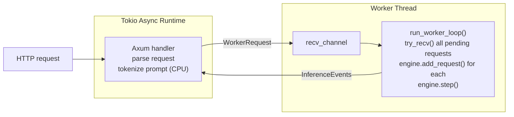

# API Server

rLLM exposes an HTTP API compatible with both OpenAI and Anthropic formats.
The server uses a worker-thread architecture to bridge async HTTP handling
with synchronous GPU inference.

**Key files:**
- `src/api/mod.rs` — server setup, worker loop, shared types
- `src/api/openai.rs` — OpenAI-compatible endpoints
- `src/api/anthropic.rs` — Anthropic-compatible endpoint
- `src/api/metrics.rs` — Prometheus metrics definitions and `/metrics` endpoint
- `src/api/tls.rs` — TLS/HTTPS support
- `src/commands/serve.rs` — CLI entry point for `rllm serve`

---

## Architecture



### Why a dedicated worker thread?

GPU inference is synchronous and long-running.  Running it on Tokio's async
runtime would block other requests.  The worker thread:

1. **Owns the engine** — no `Arc<Mutex<>>` needed for the inference state
2. **Batches naturally** — `try_recv()` drains all pending requests before each step
3. **Avoids async/sync conflicts** — Metal/CUDA APIs are not async-safe

**Note:** The `SyncSender` channel capacity is configurable via `--max-pending`
(default 8).  Tune to avoid stalling HTTP handlers under burst load.

### Key Types

| Type | Purpose |
|------|---------|
| `ServerState` | Shared state: request channel, tokenizer, model name, arch, metrics |
| `WorkerRequest` | Pre-tokenized prompt + generation params + response channel + request ID |
| `RequestContext` | Per-sequence state in the worker: timing, token buffer, request ID |
| `InferenceEvent` | `Token { text }`, `Done { stop_reason, tokens }`, or `Error(String)` |
| `Metrics` | Prometheus counters, histograms, and gauges (see [Observability](#observability)) |

Tokenization happens on the async handler thread (CPU-bound, fast).  Only
the tokenized IDs cross the channel to the worker thread.

---

## Endpoints

### OpenAI-Compatible (`src/api/openai.rs`)

| Endpoint | Method | Description |
|----------|--------|-------------|
| `/v1/chat/completions` | POST | Chat completion (streaming + non-streaming) |
| `/v1/completions` | POST | Legacy text completion |
| `/v1/models` | GET | List available models |

Supports:
- `model`, `messages`, `max_tokens`, `temperature`, `top_p`
- `stream: true` for Server-Sent Events (SSE) streaming
- `tools` / `tool_choice` for function calling
- `response_format: {"type": "json_object"}` for JSON mode

### Anthropic-Compatible (`src/api/anthropic.rs`)

| Endpoint | Method | Description |
|----------|--------|-------------|
| `/v1/messages` | POST | Messages API with streaming |

Supports:
- `model`, `messages`, `max_tokens`, `temperature`
- `tools` for function calling
- SSE streaming with `message_start`, `content_block_delta`, `message_stop` events

---

## Streaming

Both APIs support SSE (Server-Sent Events) streaming:

1. Handler sends `WorkerRequest` with a `tokio::sync::mpsc::Sender<InferenceEvent>`
2. Worker thread sends `Token` events as tokens are generated
3. Handler converts events to SSE format (OpenAI `data: {...}\n\n` or Anthropic event types)
4. `Done` event triggers the final SSE message and stream close

Non-streaming mode collects all tokens, then returns the complete response
as a single JSON body.

---

## Worker Loop

The worker loop in `run_worker_loop()`:

```rust
loop {
    // 1. Drain all pending requests
    while let Ok(req) = receiver.try_recv() {
        let id = engine.add_request(req.tokens, req.max_tokens, ...);
        active_requests.insert(id, req.response_tx);
    }

    // 2. Run one engine step
    if engine.has_work() {
        let output = engine.step()?;

        // 3. Send token events
        for (seq_id, token) in output.tokens {
            let text = tokenizer.decode(&[token]);
            active_requests[&seq_id].send(InferenceEvent::Token { text });
        }

        // 4. Send completion events
        for finished in output.finished {
            active_requests[&finished.id].send(InferenceEvent::Done { ... });
            active_requests.remove(&finished.id);
        }
    }
}
```

This naturally implements continuous batching — new requests are picked up
every step, and finished requests are removed immediately.

### Request Timeouts

Each request has a deadline (`--request-timeout`, default 300s).  After every
engine step, the worker checks for expired deadlines and aborts those sequences,
sending an error to the client.  This prevents one hung request from blocking
the entire server.

### Panic Recovery

The worker thread is wrapped in `catch_unwind`.  If a GPU backend or model
panic occurs, the error is captured and sent to any waiting startup channel.
Without this, a panic would silently kill the worker and leave all in-flight
requests hanging forever.

---

## Observability

### Request IDs

Every request is assigned a unique hex ID at the handler, before it crosses
the channel to the worker thread.  The same ID appears in three places:

1. **`X-Request-Id` response header** — returned to the client on every response
   (streaming and non-streaming).
2. **Worker log** — `request_id=3a8f... seq=1 prompt_tokens=128 generated_tokens=64 ...`
3. **Response body** — the `id` field in OpenAI/Anthropic JSON responses.

This lets you correlate a client-observed issue to the server-side log line.

### Prometheus Metrics

`GET /metrics` returns all metrics in Prometheus text exposition format.
Exempted from auth (like `/health`) so scrapers don't need credentials.

| Metric | Type | Description |
|--------|------|-------------|
| `rllm_request_duration_seconds` | Histogram | End-to-end latency |
| `rllm_time_to_first_token_seconds` | Histogram | Prompt submission → first token |
| `rllm_decode_tokens_per_second` | Histogram | Decode throughput |
| `rllm_prompt_tokens_total` | Counter | Total prompt tokens |
| `rllm_completion_tokens_total` | Counter | Total generated tokens |
| `rllm_requests_total{endpoint}` | Counter | Requests per endpoint |
| `rllm_active_sequences` | Gauge | Sequences in flight |
| `rllm_waiting_sequences` | Gauge | Sequences in the admission queue |
| `rllm_prefix_cache_hits_total` | Counter | Prefix cache hits |
| `rllm_errors_total` | Counter | Engine step failures |
| `rllm_request_timeouts_total` | Counter | Requests aborted due to timeout |

**Where metrics are recorded:**
- Histograms and token counters are recorded in the worker loop when a
  sequence completes (both normal completion and stop-sequence termination).
- The `requests_total` counter is incremented in each HTTP handler.
- Gauges are updated after every engine step.

**Scraping:** Point Prometheus, Grafana Agent, Datadog, or any compatible
scraper at `http://<host>:<port>/metrics`.  Default scrape interval of 15s
is fine — the endpoint is cheap (no GPU work, just serialising in-memory
atomics).

---

## TLS Support

`src/api/tls.rs` provides HTTPS via:

- **Manual certificates**: `--tls-cert` and `--tls-key` CLI flags
- **Let's Encrypt**: automatic ACME certificate provisioning

TLS is optional — plain HTTP is the default for local development.

---

## Structured Logging

All logging uses the `tracing` crate with structured fields.  Default level is
`info`; override with the `RUST_LOG` environment variable (e.g. `RUST_LOG=debug`).
Output goes to stderr in human-readable format.

---

## Graceful Shutdown

On SIGTERM or SIGINT:
1. `/health` starts returning 503 (load balancers stop sending traffic)
2. The server stops accepting new connections
3. In-flight requests are drained to completion
4. Server exits cleanly

Works for both plain HTTP and TLS modes.

---

## CLI Flags

```
rllm serve [OPTIONS]

Options:
  --model <PATH>          Path to model directory
  --host <HOST>           Bind address (default: 127.0.0.1)
  --port <PORT>           Bind port (default: 8080)
  --tp <N>                Tensor parallelism — number of GPUs (default: 0 = auto)
  --max-pending <N>       Max queued requests between handlers and worker (default: 8)
  --max-active <N>        Max concurrent sequences in the engine (default: 32)
  --request-timeout <S>   Per-request timeout in seconds (default: 300, 0 = none)
  --cert <PATH>           TLS certificate file (PEM)
  --private-key <PATH>    TLS private key file (PEM)
  --letsencrypt           Automatic TLS via Let's Encrypt
  --domain <DOMAIN>       Domain for Let's Encrypt
  --auth-config <PATH>    Path to auth config JSON
  --kv-quant <MODE>       KV cache quantization (default: turbo4)
  --stream-experts        Stream MoE experts from SSD
```

---

See also: [Architecture Overview](architecture-overview.md) ·
[Inference Engine](inference-engine.md)
