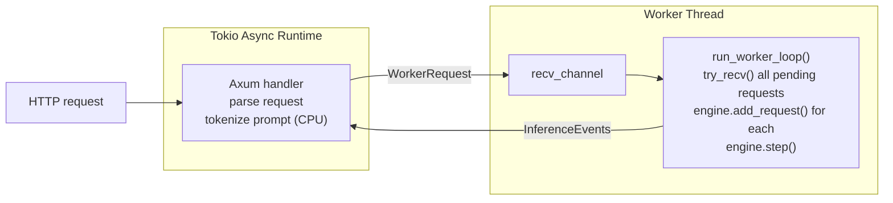

# API Server

rLLM exposes an HTTP API compatible with both OpenAI and Anthropic formats.
The server uses a worker-thread architecture to bridge async HTTP handling
with synchronous GPU inference.

**Key files:**
- `src/api/mod.rs` — server setup, worker loop, shared types
- `src/api/openai.rs` — OpenAI-compatible endpoints
- `src/api/anthropic.rs` — Anthropic-compatible endpoint
- `src/api/tls.rs` — TLS/HTTPS support
- `src/commands/serve.rs` — CLI entry point for `rllm serve`

---

## Architecture



### Why a dedicated worker thread?

GPU inference is synchronous and long-running.  Running it on Tokio's async
runtime would block other requests.  The worker thread:

1. **Owns the engine** — no `Arc<Mutex<>>` needed for the inference state
2. **Batches naturally** — `try_recv()` drains all pending requests before each step
3. **Avoids async/sync conflicts** — Metal/CUDA APIs are not async-safe

**Note:** The `SyncSender` channel capacity should be tuned to avoid stalling
HTTP handlers under burst load.

### Key Types

| Type | Purpose |
|------|---------|
| `ServerState` | Shared state: request channel, tokenizer, model name, arch |
| `WorkerRequest` | Pre-tokenized prompt + generation params + response channel |
| `InferenceEvent` | `Token { text }`, `Done { stop_reason, tokens }`, or `Error(String)` |

Tokenization happens on the async handler thread (CPU-bound, fast).  Only
the tokenized IDs cross the channel to the worker thread.

---

## Endpoints

### OpenAI-Compatible (`src/api/openai.rs`)

| Endpoint | Method | Description |
|----------|--------|-------------|
| `/v1/chat/completions` | POST | Chat completion (streaming + non-streaming) |
| `/v1/completions` | POST | Legacy text completion |
| `/v1/models` | GET | List available models |

Supports:
- `model`, `messages`, `max_tokens`, `temperature`, `top_p`
- `stream: true` for Server-Sent Events (SSE) streaming
- `tools` / `tool_choice` for function calling

### Anthropic-Compatible (`src/api/anthropic.rs`)

| Endpoint | Method | Description |
|----------|--------|-------------|
| `/v1/messages` | POST | Messages API with streaming |

Supports:
- `model`, `messages`, `max_tokens`, `temperature`
- `tools` for function calling
- SSE streaming with `message_start`, `content_block_delta`, `message_stop` events

---

## Streaming

Both APIs support SSE (Server-Sent Events) streaming:

1. Handler sends `WorkerRequest` with a `tokio::sync::mpsc::Sender<InferenceEvent>`
2. Worker thread sends `Token` events as tokens are generated
3. Handler converts events to SSE format (OpenAI `data: {...}\n\n` or Anthropic event types)
4. `Done` event triggers the final SSE message and stream close

Non-streaming mode collects all tokens, then returns the complete response
as a single JSON body.

---

## Worker Loop

The worker loop in `run_worker_loop()`:

```rust
loop {
    // 1. Drain all pending requests
    while let Ok(req) = receiver.try_recv() {
        let id = engine.add_request(req.tokens, req.max_tokens, ...);
        active_requests.insert(id, req.response_tx);
    }

    // 2. Run one engine step
    if engine.has_work() {
        let output = engine.step()?;

        // 3. Send token events
        for (seq_id, token) in output.tokens {
            let text = tokenizer.decode(&[token]);
            active_requests[&seq_id].send(InferenceEvent::Token { text });
        }

        // 4. Send completion events
        for finished in output.finished {
            active_requests[&finished.id].send(InferenceEvent::Done { ... });
            active_requests.remove(&finished.id);
        }
    }
}
```

This naturally implements continuous batching — new requests are picked up
every step, and finished requests are removed immediately.

---

## TLS Support

`src/api/tls.rs` provides HTTPS via:

- **Manual certificates**: `--tls-cert` and `--tls-key` CLI flags
- **Let's Encrypt**: automatic ACME certificate provisioning

TLS is optional — plain HTTP is the default for local development.

---

## CLI Flags

```
rllm serve [OPTIONS]

Options:
  --model <PATH>       Path to model directory
  --host <HOST>        Bind address (default: 0.0.0.0)
  --port <PORT>        Bind port (default: 8080)
  --tp <N>             Tensor parallelism (number of GPUs)
  --tls-cert <PATH>    TLS certificate file
  --tls-key <PATH>     TLS private key file
```

---

See also: [Architecture Overview](architecture-overview.md) ·
[Inference Engine](inference-engine.md)
