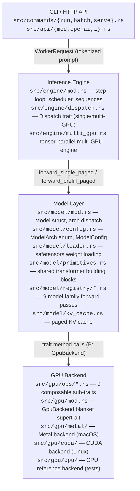
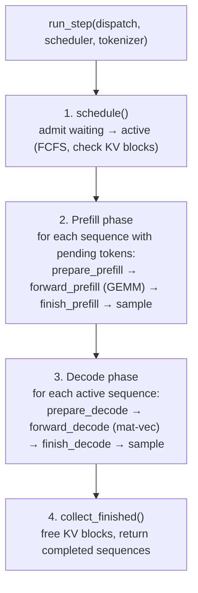

# Architecture Overview

rLLM is a Rust LLM inference engine with native GPU backends (Metal on macOS,
CUDA on Linux).  This document describes the end-to-end flow from user request
to generated tokens, and how the major subsystems connect.

---

## High-Level Components



---

## Request Lifecycle

### 1. Entry Point

All three CLI commands converge on the same engine:

| Command | Entry | What it does |
|---------|-------|-------------|
| `rllm run` | `commands/run.rs` | Single prompt → step loop → stream to stdout |
| `rllm batch` | `commands/batch.rs` | JSONL file → step loop → collect to output file |
| `rllm serve` | `commands/serve.rs` → `api/mod.rs` | HTTP server → worker thread → step loop → SSE stream |

The serve path tokenizes on async Tokio threads, then sends `WorkerRequest`
structs over a bounded `std::sync::mpsc::SyncSender` to a dedicated worker
thread that owns the engine.

### 2. Engine Step Loop

Every entry point drives the same `run_step()` function:



The `Dispatch` trait abstracts over single-GPU vs multi-GPU topologies.  Both
`SingleGpuDispatch<B>` and `MultiGpuDispatch` implement `Dispatch`, so the
step loop is written once.

### 3. Model Forward Pass

The `Model<B>` struct holds all weights and pre-allocated buffers.  Forward
calls dispatch on `ModelArch` (a 9-variant enum) to the correct registry
module:

- **Standard dense** (Llama, Qwen2, Phi, Mistral): share `llama.rs` via `ArchFeatures` flags
- **MoE** (Qwen3 MoE, Mixtral, GPT-OSS): expert routing + sparse FFN
- **Hybrid** (Qwen 3.5): 75% DeltaNet linear attention + 25% GQA softmax

Each registry module composes shared primitives from `primitives.rs`:
`embed_token → (qkv_projection → apply_rope → paged_kv_and_attention → fused_ffn) × N layers → final_norm_and_lm_head`.

### 4. GPU Execution

Primitives call trait methods on `B: GpuBackend`.  The blanket supertrait
resolves at compile time to the platform backend:

- **macOS**: `MetalBackend` — all work accumulates in a single `CommandBuffer`,
  committed once per step via `flush()`
- **Linux**: `CudaBackend` — NVRTC-compiled kernels, async CUDA streams, NCCL
  for multi-GPU all-reduce
- **Tests**: `CpuBackend` — pure Rust reference implementation

### 5. Token Sampling

After the forward pass produces logits, `sample()` applies temperature scaling
and top-p (nucleus) sampling to select the next token.  The token is appended
to the sequence's generated list, and the cycle repeats.

---

## Four-Layer Dispatch Pipeline

The architecture chains four dispatch layers, each with a distinct mechanism:

| Layer | Mechanism | Boundary |
|-------|-----------|----------|
| 1. API → Worker | Channel (`SyncSender`) | Async HTTP → sync worker thread |
| 2. Engine → Model | Enum match (`ModelArch`) | Architecture-agnostic loop → model-specific forward |
| 3. Model → GPU | Trait methods (`GpuBackend`) | Model logic → platform-specific kernels |
| 4. GPU → Hardware | Command buffer / CUDA stream | Rust → Metal shaders / CUDA kernels |

Each layer is zero-cost or near-zero-cost.  Trait methods monomorphize away
(no vtable), and the enum match compiles to a jump table.  The only runtime
cost is the channel send/recv at Layer 1, which provides natural backpressure.

---

## Platform Selection

Platform-specific code uses `#[cfg]` attributes, not feature flags:

```rust
#[cfg(target_os = "macos")]
pub(crate) type Backend = MetalBackend;

#[cfg(feature = "cuda")]
pub(crate) type Backend = CudaBackend;

#[cfg(not(any(target_os = "macos", feature = "cuda")))]
pub(crate) type Backend = CpuBackend;
```

This means `cargo build` on macOS always uses Metal, `cargo build --features cuda`
on Linux uses CUDA, and plain `cargo build` on Linux uses the CPU backend
(useful for CI and testing).

---

## Related Documents

- [GPU Backend](gpu-backend.md) — trait hierarchy, Metal/CUDA internals, quantization
- [Inference Engine](inference-engine.md) — step loop, scheduler, Dispatch trait
- [Model Layer](model-layer.md) — config, loader, registry, primitives
- [API Server](api-server.md) — HTTP endpoints, streaming, worker thread
- [KV Cache](kv-cache.md) — paged cache, block allocation, memory management
- [Tool Calling](tool-calling.md) — function calling, per-architecture formats, parsing
