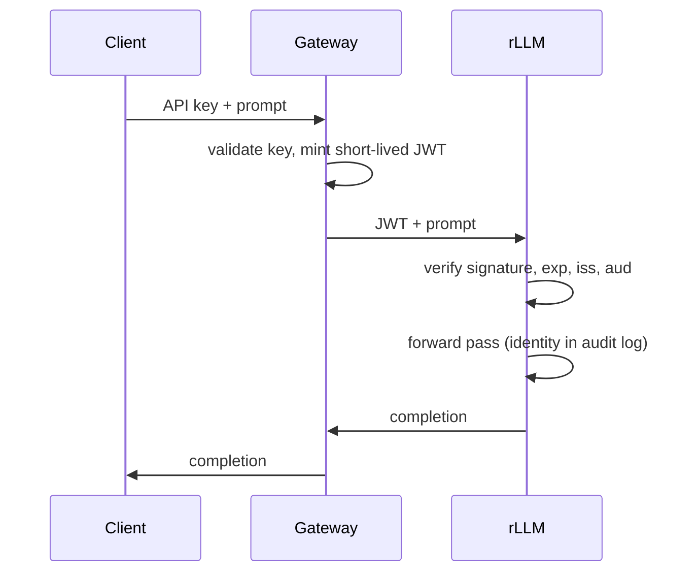
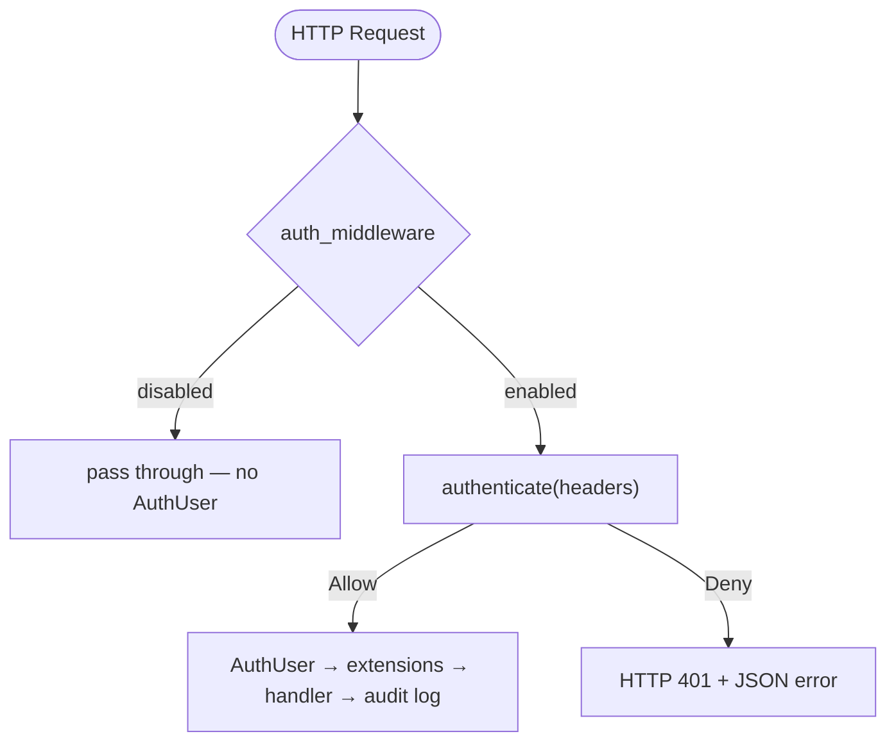
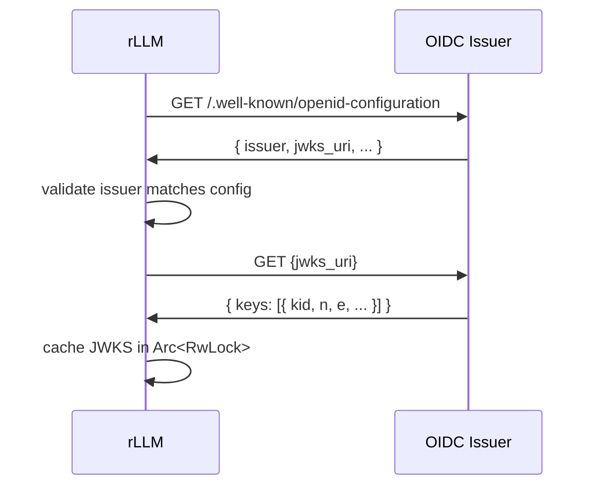
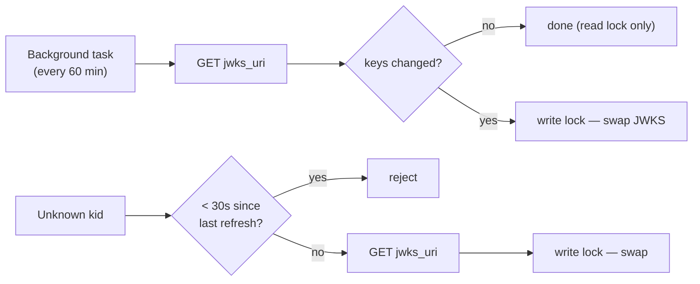

# Authentication

Optional, pluggable authentication for the rLLM API server.  Disabled by
default — enabled via `--auth-config auth.json`.

---

## Design

### Why Optional

rLLM's default deployment is single-user: localhost, SSH tunnel, trusted LAN.
Auth adds nothing when you're the only user.  It becomes valuable when rLLM
is behind a gateway that mints scoped tokens, or shared among a team.

### Why Not Gateway-Only

A gateway can handle all auth, but that leaves no identity at the inference
layer and no audit trail on the server itself.  If the network boundary is
breached, anyone who reaches the port gets unlimited access.

rLLM's auth closes this gap — defense-in-depth, not a replacement.



### Architecture

Auth is fully on or fully off.  No fallbacks, no fake identities.



Three hooks cover the provider lifecycle:

| Hook | When | What |
|------|------|------|
| `init(config)` | Startup | Parse config, fetch keys. Errors abort startup. |
| `authenticate(headers)` | Every request | `Allow(User)` or `Deny(Status, Reason)`. Hot path. |
| `background(Arc<Self>)` | After init | Optional maintenance (JWKS refresh, hash reload). |

Providers use enum dispatch (`AuthProviderKind`), not `dyn` — the set is
known at compile time.

---

## Providers

### Static API Key

For personal inference servers where OIDC is overkill.  A shared secret
compared against an argon2id hash — no identity provider, no JWTs, no key
rotation infrastructure.

```json
{
  "provider": "static_api_key",
  "key_hash": "$argon2id$v=19$m=19456,t=2,p=1$SALT$HASH"
}
```

Generate the hash:

```bash
# argon2 CLI:
echo -n "my-secret-key" | argon2 $(openssl rand -hex 16) -id -e

# Python (pip install argon2-cffi):
python3 -c "from argon2 import PasswordHasher; print(PasswordHasher().hash('my-secret-key'))"
```

Use it:

```bash
curl http://localhost:8080/v1/chat/completions \
  -H "Authorization: Bearer my-secret-key" \
  -H "Content-Type: application/json" \
  -d '{"messages": [{"role": "user", "content": "Hello"}]}'
```

**Hot reload.**  The background task watches the config file's mtime every
30 seconds.  If the file changes, the new hash is loaded — no restart needed.
Invalid config keeps the old hash and logs a warning.

**Gaps vs OIDC:**

| Gap | Impact |
|-----|--------|
| Single shared key | `sub` is always `"apikey"` — no per-user audit trail |
| No token expiry | Key valid forever until you edit the config |
| No per-user quotas | All callers share one identity |
| ~30-50ms verify | argon2id is intentionally slow (anti-brute-force) |
| 30s reload window | Old key works briefly after rotation |

Use OIDC if you need per-user identity, token expiry, or instant rotation.

### OIDC

Validates JWTs against an OpenID Connect issuer's published signing keys.

```json
{
  "provider": "oidc",
  "issuer": "https://accounts.google.com",
  "audience": "my-rllm-instance"
}
```

| Field | What |
|-------|------|
| `issuer` | OIDC issuer URL.  rLLM fetches `{issuer}/.well-known/openid-configuration` at startup.  Must match the `iss` claim. |
| `audience` | Expected `aud` claim.  Typically the client ID or service identifier. |

**Startup:**



Fails fast — server refuses to start if any step fails.

**Per-request validation:**

1. Extract `Authorization: Bearer <token>`
2. Decode JWT header (unverified) -> `kid`
3. Look up `kid` in cached JWKS (read lock)
4. If missing -> one eager refresh (rate-limited to 1/30s)
5. Verify signature + `exp` + `iss` + `aud`
6. `Allow(AuthUser { sub })` or `Deny(401, reason)`

Common case: one read lock + one signature check.  Microseconds, no network.

**Key rotation:**



Write lock only acquired when keys actually rotate.

**What we validate:**

| Claim | Check |
|-------|-------|
| Signature | Algorithm from JWK (RS256, ES256, etc.) |
| `exp` | Not expired |
| `iss` | Matches configured issuer |
| `aud` | Matches configured audience |

**What we don't:** authorization (all authenticated users are equal), token
revocation (short-lived tokens; revocation is a gateway concern), scopes or
roles (not relevant for an inference API).

### No Auth (Default)

When `--auth-config` is omitted, the middleware is a no-op.  On localhost
this just works.  On external interfaces (`--host 0.0.0.0`), rLLM requires
`--dangerous-no-auth` to confirm.

---

## TLS

When auth is enabled without TLS, rLLM prints a startup warning — tokens,
prompts, and completions are plaintext.  On localhost or over an SSH tunnel
this is fine.  On external interfaces, enable TLS (`--cert`/`--private-key`
or `--letsencrypt`).

---

## Per-User Logging

Auth enabled:
```
seq 123  |  user-42  |  500 prompt (200 cached) + 150 gen  |  TTFT 45 ms  |  32.1 tok/s  |  4.67s  |  eos
```

Auth disabled:
```
seq 123  |  500 prompt (200 cached) + 150 gen  |  TTFT 45 ms  |  32.1 tok/s  |  4.67s  |  eos
```

Always uses `AuthUser.sub` — the stable identifier, not a display name.

---

## Adding a Custom Provider

1. Create `src/api/auth/your_provider.rs` implementing `AuthProvider`
2. Add `pub(crate) mod your_provider;` to `src/api/auth/mod.rs`
3. Add a variant to `AuthProviderKind`
4. Add match arms in `authenticate()`, `spawn_background()`, `is_enabled()`
5. Add a match arm in the factory in `src/api/mod.rs`

The trait takes `&HeaderMap` and returns `Allow`/`Deny`.

---

## Files

| File | What |
|------|------|
| `src/api/auth/mod.rs` | Trait, types, enum dispatch, middleware |
| `src/api/auth/oidc.rs` | OIDC discovery, JWKS caching, JWT verification |
| `src/api/auth/static_api_key.rs` | Static API key, argon2id hash, hot reload |
| `src/api/mod.rs` | Wires auth into ServerState and router |
| `src/commands/serve.rs` | `--auth-config` CLI arg |

---

See also: [Threat Model](threat-model.md) ·
[Production Considerations](production-considerations.md)
