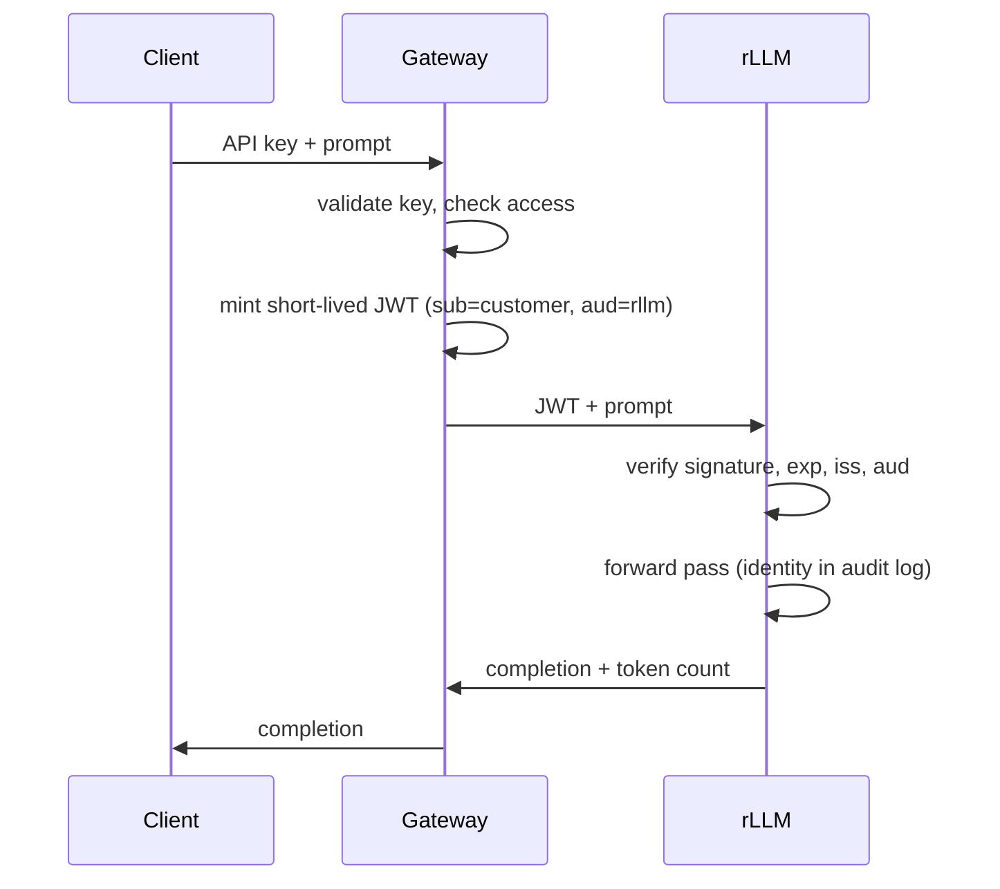
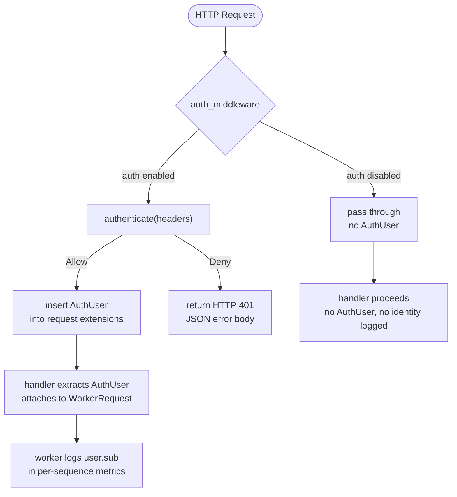
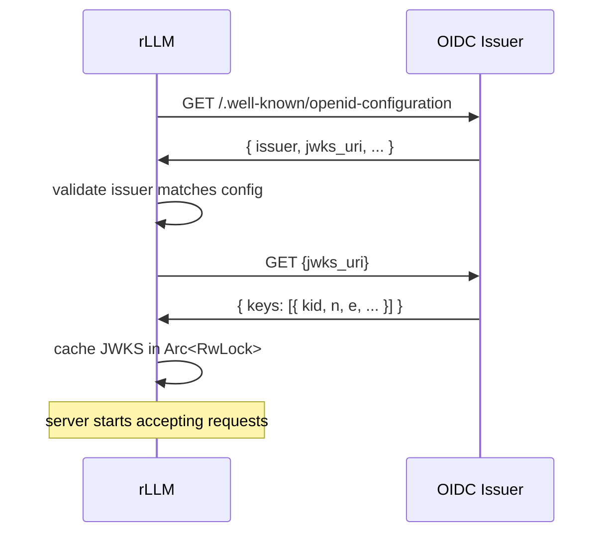
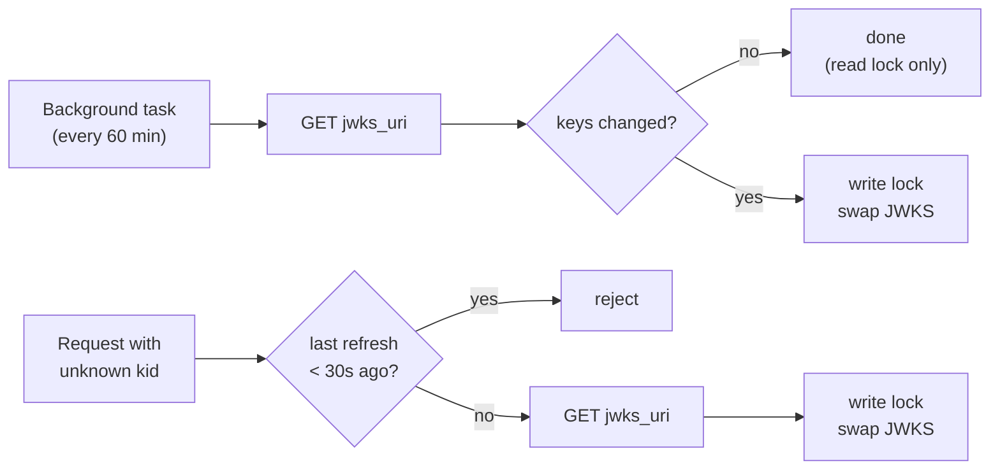

# Authentication

Optional, pluggable authentication for the rLLM API server.  Disabled by
default — enabled via `--auth-config auth.json`.

---

## Why Optional

rLLM's default deployment is single-user: localhost, SSH tunnel, trusted LAN.
Auth adds nothing when you're the only user.  It becomes valuable when rLLM
is behind a gateway that mints scoped tokens, or shared among a team.

## Why Not Gateway-Only

A gateway can handle all auth and forward requests to a "dumb" inference
server.  But that leaves gaps: no identity at the inference layer, no audit
trail on the server itself.  If the network boundary is breached, anyone who
reaches the port gets unlimited access.

rLLM's auth closes this gap — the gateway authenticates the user and mints
a scoped JWT, rLLM validates it.  Defense-in-depth, not a replacement.



## Why Not Sessions / OAuth Flows / Login Pages

rLLM is an inference API, not a web app.  It validates tokens — someone else
mints them.  That someone might be a gateway, an identity provider, or a CLI
tool that hits the OIDC token endpoint.  rLLM checks the signature, expiry,
issuer, and audience.  Nothing more.

---

## How It Works

Auth is either fully on or fully off.  No fallbacks, no fake identities.



### The Trait

Three hooks cover the full provider lifecycle:

| Hook | When | What |
|------|------|------|
| `init(config)` | Startup | Fetch JWKs, load keys, validate config. Errors abort startup. |
| `authenticate(headers)` | Every request | Headers in, `Allow(User)` or `Deny(Status, Reason)` out. Hot path — no network I/O. |
| `background(self: Arc<Self>)` | After init | Optional maintenance (JWKS refresh, cache expiry). Default: no-op. |

HTTP-close design: `authenticate()` takes `&HeaderMap`, returns an HTTP
`StatusCode`.  No framework-specific abstractions.

### Enum Dispatch

The set of providers is known at compile time.  `AuthProviderKind` is an
enum (`None`, `Oidc`) — no `dyn`, no `async-trait` crate.  Same pattern as
`TlsMode` in `tls.rs`.

---

## Configuration

```bash
rllm serve --model ./my-model --auth-config auth.json
```

The JSON file has a `"provider"` field that selects the implementation.
The rest is passed to the provider's `init()` hook.

### OIDC

```json
{
  "provider": "oidc",
  "issuer": "https://accounts.google.com",
  "audience": "my-rllm-instance"
}
```

| Field | What |
|-------|------|
| `issuer` | OIDC issuer URL. rLLM fetches `{issuer}/.well-known/openid-configuration` at startup. Must match the `iss` claim. |
| `audience` | Expected `aud` claim. Typically the client ID or service identifier the gateway uses when minting tokens. |

### No Auth (Default)

When `--auth-config` is omitted, the middleware is a no-op.  No headers
checked, no identity logged, no token validation.  Auth doesn't exist.

On localhost this just works.  On external interfaces (`--host 0.0.0.0`),
rLLM requires `--dangerous-no-auth` to confirm you want no authentication.

---

## OIDC Provider

Validates JWTs against an OpenID Connect issuer's published signing keys.

### Startup



If any step fails, the server refuses to start.

### Per-Request Validation

1. Extract `Authorization: Bearer <token>`
2. Decode JWT header (unverified) → get `kid`
3. Look up `kid` in cached JWKS (read lock)
4. If not found → one eager refresh (rate-limited to 1/30s)
5. Verify signature + `exp` + `iss` + `aud`
6. Return `Allow(AuthUser { sub })` or `Deny(401, reason)`

Common case: one read lock + one signature check.  Microseconds, no network.

### Key Rotation



The write lock is only acquired when keys actually rotate.  Routine refreshes
never block request-path readers.

### What We Validate

| Claim | Check |
|-------|-------|
| Signature | Algorithm from JWK (RS256, ES256, etc.) |
| `exp` | Token not expired |
| `iss` | Matches configured issuer |
| `aud` | Matches configured audience |

### What We Don't

- **Authorization** — all authenticated users have equal access
- **Token revocation** — tokens are short-lived; revocation is a gateway concern
- **Scopes or roles** — not relevant for an inference API

---

## Auth Without TLS

When auth is enabled without TLS, rLLM prints a startup warning.  Tokens,
prompts, and completions are plaintext — an attacker with network access can
intercept, read, or modify them.

On localhost this is safe (traffic stays on the machine).  On external
interfaces, TLS is required unless you pass `--dangerous-no-tls`.  SSH
tunnels are also fine — the tunnel encrypts the transport.

---

## Per-User Logging

Auth enabled:
```
seq 123  |  user-42  |  500 prompt (200 cached) + 150 gen  |  TTFT 45 ms  |  32.1 tok/s  |  4.67s  |  eos
```

Auth disabled:
```
seq 123  |  500 prompt (200 cached) + 150 gen  |  TTFT 45 ms  |  32.1 tok/s  |  4.67s  |  eos
```

Always uses `AuthUser.sub` — the stable subject identifier from the JWT.

---

## Adding a Custom Provider

1. Create `src/api/auth/your_provider.rs` implementing `AuthProvider`
2. Add `pub(crate) mod your_provider;` to `src/api/auth/mod.rs`
3. Add a variant to `AuthProviderKind` (e.g., `Custom(Arc<YourProvider>)`)
4. Add match arms in `authenticate()`, `spawn_background()`, `is_enabled()`
5. Add a match arm in the factory in `src/api/mod.rs`

The trait takes `&HeaderMap` and returns `Allow`/`Deny`.  If you know HTTP,
you can implement it.

---

## Files

| File | What |
|------|------|
| `src/api/auth/mod.rs` | Trait, types, enum dispatch, middleware |
| `src/api/auth/oidc.rs` | OIDC discovery, JWKS caching, JWT verification |
| `src/api/mod.rs` | Wires auth into ServerState and router |
| `src/commands/serve.rs` | `--auth-config` CLI arg |

---

See also: [Threat Model](threat-model.md) ·
[Production Considerations](production-considerations.md)
