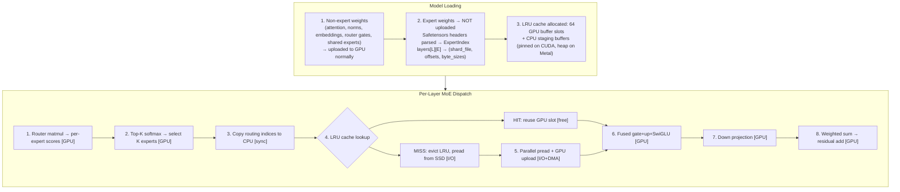

# Expert Streaming (SSD-backed MoE)

How rLLM runs Mixture-of-Experts models that don't fit in GPU memory by streaming
expert weights from NVMe SSD on demand.  Works on both Metal (Apple Silicon) and
CUDA (NVIDIA), with platform-specific transfer paths optimised for each memory model.

---

## Problem

MoE models store hundreds of expert FFN sub-networks per layer.  A model like
Qwen3.5-35b-a3b has 256 experts across 40 layers — 60 GB of expert weights in bf16.
On a 64 GB Mac, there's no room left for KV cache and scratch buffers.  Qwen3.5-397B
has 512 experts across 60 layers — 720 GB of expert weights that don't fit on any
consumer machine.

But MoE routing only activates K experts per token (K=8 for Qwen3.5-35b).  At any
given moment, 248 of 256 experts per layer are idle.  This is the key insight:
**we only need a small pool of experts in GPU memory at a time, not all N**.

## Solution: On-Demand Expert Streaming

Instead of loading all expert weights to GPU at startup, rLLM records their file
locations and loads only the router-selected experts from SSD during inference.
A GPU-side LRU cache (default 64 slots) keeps recently-used experts resident —
only cache misses trigger NVMe reads.

```
Traditional:  Load 256 × 40 experts to GPU → 60 GB VRAM
Streaming:    64 LRU cache slots on GPU    → ~384 MB VRAM (Q4)
              + pread cache-miss experts from SSD per layer per token
```

### Architecture Overview



### LRU Cache

The streamer holds a pool of GPU buffer slots as an LRU cache (default 64,
configurable, minimum K).  When the router selects K experts for a token:

- **Cache hit**: the expert's weights are already GPU-resident.  Only the LRU
  timestamp is bumped — no NVMe read, no DMA transfer.  This is free.
- **Cache miss**: the slot with the smallest timestamp is evicted, its mapping
  removed, and the new expert's weights are loaded from SSD into that slot.

Cache hits avoid both the NVMe read AND the PCIe transfer (on CUDA), which is
the dominant cost for expert streaming on discrete GPUs.  Cross-layer locality
(same expert selected in adjacent layers) and cross-token locality (popular
experts across tokens) both contribute to hit rates.

The cache is sized to balance GPU memory use against hit rate.  For Qwen3.5-122B
with Q4, 64 slots × ~6 MB = ~384 MB — enough to cache 25% of the 256 experts per
layer.

### How File Offsets Work

Safetensors files have a simple layout:

```
[8-byte LE header_len][JSON header][tensor data region]
```

The JSON header contains `data_offsets` for each tensor — byte ranges relative to
the start of the tensor data region.  For fused expert tensors like Qwen3.5's
`gate_up_proj [num_experts, 2*moe_inter, hidden]`, each expert is a contiguous
slice along dimension 0:

```
Expert j gate data: file_offset + j × (2 × moe_inter × hidden × 2)
Expert j up data:   file_offset + j × (2 × moe_inter × hidden × 2) + (moe_inter × hidden × 2)
Expert j down data: down_file_offset + j × (hidden × moe_inter × 2)
```

This means **no preprocessing** is needed — we compute byte offsets from the
safetensors header and `pread()` directly from the original weight files.

### I/O Strategy

Expert loading uses the Unix `pread()` syscall (via Rust's `FileExt::read_exact_at`):

- **Thread-safe**: no shared file position (unlike `seek + read`)
- **Single syscall**: kernel handles the offset seek internally
- **OS page cache**: the kernel caches recently-read pages automatically;
  flash-moe reports ~71% hit rate on repeated queries, meaning most expert
  reads come from RAM after the first pass

For pre-quantized Q4 models, expert data is already Q4 on disk — the raw
Q4 bytes are pread directly into the GPU buffer with no CPU-side processing.
This reduces I/O volume 3.5x vs bf16 and eliminates quantization overhead.
For bf16 streaming, the raw bytes are copied directly to the GPU buffer.

### Why pread and Not mmap

mmap'ing 751 GB of shard files (94 × ~8 GB for Qwen3.5-397B) causes excessive
memory pressure.  Each page fault triggers a 16 KB kernel I/O operation, while
`pread()` issues 8-16 MB reads that the kernel can satisfy with large sequential
I/O.  For large MoE models, targeted pread gives the kernel better I/O scheduling
information than random page faults across hundreds of GB of virtual mappings.

---

## Metal vs CUDA Transfer Paths

The streamer detects the backend's memory model at runtime and uses the optimal
transfer path for each platform.

### Metal (Apple Silicon — Unified Memory)

On Metal, CPU and GPU share the same physical memory.  The streamer exploits this
by writing directly to GPU buffer contents from pread threads:

```
Per cache-miss thread (K threads in parallel via std::thread::scope):
  1. pread() from shard file into CPU staging buffer
  2. ptr::copy_nonoverlapping from staging buffer into GPU buffer.contents()
     (direct write to Metal buffer — no Metal API calls, safe for concurrent
      threads writing to disjoint buffer regions)
```

The `GpuCore::tensor_mut_ptr()` trait method returns `Some(*mut u8)` on Metal,
pointing to the buffer's `contents()`.  This merges the I/O and upload phases
into a single parallel pass — each thread handles both pread and memcpy for
its assigned expert.

### CUDA (NVIDIA — Discrete Memory)

On CUDA, GPU memory is separate from host memory.  Writes require explicit DMA
transfers across PCIe/NVLink.  The streamer uses a **dedicated transfer stream**
with **pinned host memory** for true async transfers:

```
Phase 1 — Parallel pread (K threads via std::thread::scope):
  Each thread:
    1. pread() from shard file into pinned host buffer (cuMemAllocHost)
    2. Return (no GPU transfer yet — CUDA API is not thread-safe)

Phase 2 — Async DMA (main thread, sequential):
  For each cache miss:
    1. cuMemcpyHtoDAsync(gpu_slot, pinned_buf, transfer_stream)
       Queued on dedicated transfer stream, returns immediately.

Phase 3 — Sync (GPU-side only):
  1. cuEventRecord(event, transfer_stream)
  2. cuStreamWaitEvent(compute_stream, event)
     Compute stream stalls only if DMA hasn't finished.
     CPU does not block.
```

Key CUDA details:
- **Pinned (page-locked) memory**: allocated once at init via `cuMemAllocHost`.
  Required for true async HtoD transfers — unpinned memory silently falls back
  to synchronous, which is still correct but slower.
- **Dedicated transfer stream**: `CU_STREAM_NON_BLOCKING` stream separate from
  the compute stream, so DMA and kernel execution can overlap.
- **Event-based sync**: `cuEventRecord` on transfer stream + `cuStreamWaitEvent`
  on compute stream.  Both operations are GPU-side only — the CPU returns
  immediately.  The compute stream stalls only if it reaches the wait point
  before the DMA engine finishes.
- **`tensor_mut_ptr()` returns `None`**: device memory is not CPU-accessible,
  so the direct-write path used on Metal is not available.  The fallback
  async DMA path is used instead.

---

## Key Types

### ExpertIndex (`model/expert_stream.rs`)

Records where every expert lives on disk, built during model loading:

```rust
ExpertIndex {
    layers: Vec<Vec<ExpertLocation>>,  // [layer][expert] → file location
    shard_files: Arc<Vec<File>>,       // open file handles for pread (Arc for thread sharing)
    hidden: usize,                     // hidden dimension
    moe_inter: usize,                  // expert intermediate dimension
    prequantized: bool,                // true if Q4 on disk (pre-quantized model)
}
```

### ExpertLocation

Where one expert's weights live within a safetensors shard file:

```rust
ExpertLocation {
    shard_gate_up: usize,   // shard file index for gate/up tensors
    shard_down: usize,      // shard file index for down tensor
    gate_offset: u64,       // absolute file byte offset
    up_offset: u64,         // absolute file byte offset
    down_offset: u64,       // absolute file byte offset
    gate_bytes: usize,      // byte size of gate projection
    up_bytes: usize,        // byte size of up projection
    down_bytes: usize,      // byte size of down projection
}
```

`gate_up_contiguous()` returns true when `up_offset == gate_offset + gate_bytes`,
which is the case for Qwen3.5's fused format.  This enables a single pread for
both gate and up projections instead of two.

### ExpertStreamer (`model/expert_stream.rs`)

Manages the LRU cache of GPU buffer slots and loads experts on demand:

```rust
ExpertStreamer {
    index: ExpertIndex,                              // file locations
    cache: Vec<ExpertSlot>,                          // LRU cache of GPU buffers (default 64)
    cache_map: UnsafeCell<HashMap<(usize, usize), usize>>,  // (layer, expert) → slot
    lru_clock: Cell<u64>,                            // monotonic counter
    lru_timestamps: UnsafeCell<Vec<u64>>,            // per-slot last-used time
    active_indices: UnsafeCell<Vec<usize>>,           // current token's slot mapping
    k: usize,                                        // experts per token
    read_bufs: UnsafeCell<Vec<SlotReadBufs>>,        // CPU staging (pinned on CUDA)
}
```

Interior mutability (`UnsafeCell`, `Cell`) allows `load_experts(&self, ...)` to
mutate cache state through a shared reference, matching the GPU tensor interior
mutability pattern.  Safety is guaranteed by single-threaded inference — each
model instance is accessed by exactly one thread at a time.

### ExpertSlot

One expert's worth of GPU-resident weight buffers:

```rust
ExpertSlot {
    gate_proj: Tensor,  // [moe_inter, hidden]
    up_proj: Tensor,    // [moe_inter, hidden]
    down_proj: Tensor,  // [hidden, moe_inter]
}
```

### SlotReadBufs

Per-slot CPU staging buffers for parallel pread:

```rust
SlotReadBufs {
    gate_up: ReadBuf,   // combined gate+up buffer (single pread for fused format)
    down: ReadBuf,      // down projection buffer
}

enum ReadBuf {
    Heap(Vec<u8>),       // Metal/CPU: regular heap allocation
    Pinned(PinnedBuf),   // CUDA: page-locked via cuMemAllocHost
}
```

On CUDA, pinned buffers are allocated once at init and reused — pinned allocation
is expensive (~1 ms per call) but enables true async DMA transfers.

---

## Integration Points

### Loader (`model/loader/`)

When `--stream-experts` is passed:

1. `build_expert_index_from_safetensors()` reads safetensors headers and computes
   per-expert byte offsets without loading expert data
2. `load_weights_inner()` is called with `skip_experts=true`, which loads router
   gates, shared experts, and all non-MoE weights normally, but skips the expert
   upload entirely
3. The `ExpertIndex` is returned alongside the weights

Supports two expert storage formats (auto-detected):
- **Fused** (Qwen3.5): `gate_up_proj [N, 2*inter, hidden]` + `down_proj [N, hidden, inter]`
- **Per-expert** (Qwen3-MoE, Mixtral): separate `gate_proj`, `up_proj`, `down_proj` per expert

Pre-quantized Q4 models are detected via safetensors metadata
(`__metadata__.quantization == "rllm-q4"`).  When detected, Q4 byte counts are
used for offset calculation and buffer allocation — 3.5x less I/O than bf16.

### Engine Loader (`engine/loader.rs`)

After weight loading, creates the `ExpertStreamer` and wires it into the
architecture's `MoeBuffers` via `create_forward()`:

```rust
let expert_streamer = expert_index.map(|index| {
    ExpertStreamer::new(&backend, index, config.num_experts_per_tok)
});
let forward = create_forward(arch, &config, &backend, 1, expert_streamer);
```

This allocates the LRU cache slots, CPU staging buffers, and prints cache stats
(e.g., `"expert streaming: 64 cache slots (384 MB), 8 experts/tok, 6 MB per expert load"`).

### Primitives (`model/primitives.rs`)

`moe_expert_dispatch_streamed()` mirrors `moe_expert_dispatch()` but calls
`streamer.load_experts()` instead of indexing into `Vec<ExpertWeights>`.
Uses the fused gate+up+SwiGLU kernel from the `GpuMoe` trait.

`moe_ffn_block_streamed()` wraps the full sequence: RMSNorm → route → streamed
dispatch → residual add.

### Model Registry (`model/registry/`)

Each MoE model's `moe_ffn_block` checks `m.expert_streamer.is_some()` and dispatches
to the streamed or resident path accordingly:

| Model | File | Streaming Support |
|-------|------|-------------------|
| Qwen 3.5 | `registry/qwen3_5.rs` | Yes |
| Qwen3 MoE | `registry/qwen3_moe.rs` | Yes |
| Mixtral | `registry/mixtral.rs` | Yes |
| GPT-OSS | `registry/gpt_oss.rs` | Not yet (uses biased dispatch) |

---

## Memory Budget

### Qwen3.5-35b-a3b (256 experts, K=8)

| Component | bf16 | Q4 |
|-----------|------|-----|
| Non-expert weights | ~7 GB | ~3 GB |
| 64-slot LRU cache | ~384 MB | ~120 MB |
| KV cache | 80 MB - 2.5 GB | 80 MB - 2.5 GB |
| **Total GPU** | **~7-10 GB** | **~3-6 GB** |
| Without streaming | 67 GB (doesn't fit) | ~22 GB |

### Qwen3.5-122B-A10B (256 experts, K=10)

| Component | bf16 | Q4 |
|-----------|------|-----|
| Non-expert weights | ~15 GB | ~5 GB |
| 64-slot LRU cache | ~1.5 GB | ~432 MB |
| KV cache | ~1 GB | ~1 GB |
| **Total GPU** | **~17 GB** | **~6-7 GB** |
| Without streaming | ~230 GB (doesn't fit) | ~67 GB |

### Qwen3.5-397B-A17B (512 experts, K=10)

| Component | bf16 |Q4 |
|-----------|------|-----|
| Non-expert weights | ~20 GB | ~7 GB |
| 64-slot LRU cache | ~1.5 GB | ~432 MB |
| KV cache | ~2 GB | ~2 GB |
| **Total GPU** | **~22 GB** | **~9 GB** |
| Without streaming | 720+ GB (impossible) | ~214 GB |

---

## Performance

All benchmarks use `--stream-experts`.  ⚡ marks expert streaming results.

### Apple M4 Max — 16-core CPU, 40-core GPU, 64 GB unified, 546 GB/s

| Model | Params | bf16 | Q4 | TTFT (bf16) | TTFT (Q4) |
|-------|--------|------|-----|-------------|-----------|
| Qwen3.5 35B-A3B ⚡ | 35.1B (3.3B active) | 3.0 tok/s | — | 2,600 ms | 10,600 ms |
| Qwen3.5 27B ⚡ | ~27B | 1.7 tok/s | 15.5 tok/s | 52,800 ms | 2,000 ms |
| Qwen3.5 122B-A10B ⚡ | 122B (10B active) | 1.0 tok/s | 8.0 tok/s | 19,900 ms | 3,300 ms |
| Qwen3.5 397B-A17B ⚡ | 397B (17B active) | 0.3 tok/s | 4.4 tok/s | 48,200 ms | 3,200 ms |

The 397B model (751 GB on disk, 213 GB Q4) runs on a 64 GB machine using ~20 GB GPU
memory.  Pre-quantized Q4 streaming reduces I/O volume 3.5x vs bf16.

### NVIDIA GeForce RTX 4090 — 48 GB GDDR6X, 1.01 TB/s

| Model | Params | bf16 | Q4 | TTFT (bf16) | TTFT (Q4) |
|-------|--------|------|-----|-------------|-----------|
| Qwen3.5 122B-A10B ⚡ | ~122B (~10B active) | 1.2 tok/s | 4.0 tok/s | 8,800 ms | 3,500 ms |
| Qwen3.5 397B-A17B ⚡ | ~397B (~17B active) | 0.5 tok/s | 1.9 tok/s | 11,200 ms | 3,500 ms |

GPU-side LRU expert cache (64 slots, ~432 MB Q4 / ~1.5 GB bf16).  Cache hits skip
both NVMe reads and PCIe transfers entirely.  Q4 is 3.3-3.8x faster than bf16.
Async DMA via dedicated CUDA transfer stream with pinned host memory.

### NVIDIA RTX PRO 6000 Blackwell — 96 GB GDDR7, 1.53 TB/s

| Model | Params | bf16 | Q4 | TTFT (bf16) | TTFT (Q4) |
|-------|--------|------|-----|-------------|-----------|
| Qwen3.5 122B-A10B ⚡ | 122B (10B active) | 1.7 tok/s | 3.9 tok/s | 9,500 ms | 6,800 ms |

Q4 pre-quantized streaming is critical for performance — experts are already Q4 on
disk, so pread loads 3.5x fewer bytes per expert with no CPU-side quantization.

### Bottleneck Analysis

Per-layer time breakdown (Qwen3.5-35b-a3b, bf16, M4 Max):
- Attention (DeltaNet/GQA): ~1 ms
- Routing: ~0.1 ms
- **Expert I/O**: ~6 ms (8 × 6 MB from SSD)
- Expert compute: ~0.5 ms

Expert I/O dominates.  Implemented optimisations:
1. **LRU cache** — 64-slot GPU-side cache; hits skip both NVMe read and DMA transfer
2. **Parallel pread** — K threads reading cache-miss experts concurrently (`std::thread::scope`)
3. **Fused gate+up read** — single pread for contiguous gate+up (Qwen3.5 fused format)
4. **Pre-quantized Q4** — 3.5x less I/O volume per expert; no CPU quantization overhead
5. **Async DMA** (CUDA) — dedicated transfer stream overlaps DMA with compute
6. **Pinned host memory** (CUDA) — enables true async HtoD via `cuMemAllocHost`
7. **Direct GPU writes** (Metal) — pread threads write directly to `buffer.contents()`

---

## Usage

```bash
# Stream experts from SSD (bf16)
rllm run --model models/qwen3.5-35b-a3b \
  --prompt "Hello" --stream-experts

# Stream experts from a pre-quantized Q4 model (fastest)
rllm run --model models/qwen3.5-35b-a3b-q4 \
  --prompt "Hello" --stream-experts

# Works with serve too
rllm serve --model models/qwen3.5-397B-q4 \
  --stream-experts --port 8080
```

The `--stream-experts` flag works with Qwen3.5, Qwen3-MoE, and Mixtral.
Dense models ignore the flag.

---

## Related Files

| File | Purpose |
|------|---------|
| `model/expert_stream.rs` | ExpertIndex, ExpertStreamer, LRU cache, pread loading, index building |
| `model/loader/` | Expert index construction from safetensors headers |
| `model/primitives.rs` | `moe_expert_dispatch_streamed()`, `moe_ffn_block_streamed()` |
| `model/forward.rs` | `MoeBuffers.expert_streamer` field |
| `gpu/ops/core.rs` | `GpuCore` trait: `tensor_mut_ptr()`, `alloc_pinned_buf()`, `copy_to_tensor_async()`, `sync_transfers()` |
| `gpu/ops/moe.rs` | `GpuMoe` trait (fused kernels used by both streaming and resident paths) |
| `gpu/metal/kernels/moe.rs` | Metal fused gate+up+SwiGLU and combine+residual |
| `gpu/cuda/kernels/core.rs` | CUDA pinned alloc, async HtoD, transfer stream sync |
| `gpu/cuda/backend.rs` | CUDA transfer stream + event setup |
| `gpu/metal/shaders/moe.metal` | Fused gate+up+SwiGLU and combine+residual Metal shaders |
| `commands/run.rs` | `--stream-experts` CLI flag (run command) |
| `commands/serve.rs` | `--stream-experts` CLI flag (serve command) |
| `engine/loader.rs` | ExpertStreamer initialization after model load |

## Design Inspiration

The SSD streaming architecture is inspired by
[flash-moe](https://github.com/danveloper/flash-moe), which runs Qwen3.5-397B
at 4.4 tok/s on a 48 GB MacBook using parallel `pread()`, double-buffered expert
slots, and a pipelined GPU command buffer architecture.  rLLM uses parallel
pread with fused gate+up reads and an LRU expert cache.
We tested mmap-based streaming but found it slower for large shard files
(751 GB across 94 files) — page fault overhead (16 KB granularity) exceeds
the cost of targeted 8-16 MB pread calls.
