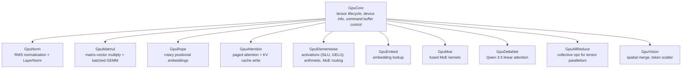

# GPU Backend

The GPU backend is rLLM's hardware abstraction layer.  It defines a set of
composable traits for GPU operations, with platform-specific implementations
for Metal (macOS), CUDA (Linux), and CPU (testing).

**Key files:**
- `src/gpu/ops/*.rs` — trait definitions (11 files)
- `src/gpu/mod.rs` — `GpuBackend` blanket supertrait, `Backend` type alias, Q4 quantization
- `src/gpu/metal/` — Metal backend
- `src/gpu/cuda/` — CUDA backend
- `src/gpu/cpu/` — CPU reference backend

---

## Trait Hierarchy

The GPU interface is split into 11 composable sub-traits rather than a single
monolithic trait.  Each sub-trait maps to one kernel family:



All sub-traits extend `GpuCore` (which owns the associated `Tensor` type).
The `GpuBackend` supertrait is defined via a blanket impl:

```rust
pub(crate) trait GpuBackend:
    GpuCore + GpuNorm + GpuMatmul + GpuRope + GpuAttention
    + GpuElementwise + GpuEmbed + GpuDeltaNet + GpuAllReduce
    + GpuMoe + GpuVision { }

impl<T> GpuBackend for T
where T: GpuCore + GpuNorm + GpuMatmul + ... { }
```

Model code uses `B: GpuBackend` as a single bound.  Primitive functions use
minimal bounds (e.g., `rms_norm` only requires `B: GpuNorm`) for fine-grained
testability.

### Why composable sub-traits?

1. **Minimal bounds** — each function declares exactly the capabilities it needs
2. **Independent implementation** — adding a new kernel family doesn't touch existing traits
3. **Testability** — a test backend can implement only the traits it needs
4. **Zero cost** — all trait methods monomorphize at compile time, no vtable

---

## Metal Backend (`src/gpu/metal/`)

```
metal/
├── mod.rs         — re-exports MetalBackend, MetalTensor
├── backend.rs     — MetalBackend struct, pipeline compilation, async dispatch
├── tensor.rs      — MetalTensor (Metal buffer + shape + dtype)
├── kernels/       — one file per sub-trait (impl GpuFoo for MetalBackend)
│   ├── core.rs
│   ├── norm.rs
│   ├── matmul.rs
│   ├── rope.rs
│   ├── attention.rs
│   ├── elementwise.rs
│   ├── embed.rs
│   ├── moe.rs
│   ├── deltanet.rs
│   ├── allreduce.rs
│   └── vision.rs
└── shaders/       — .metal shader source files (embedded via include_str!)
```

### Command Buffer Batching

The Metal backend's key performance optimization is **single command buffer
per engine step**.  Instead of committing work kernel-by-kernel:

1. `dispatch_async()` creates a compute encoder, binds parameters and buffers,
   dispatches threadgroups, and ends the encoder — but does **not** commit.
2. All kernel dispatches within a step accumulate into the same `CommandBuffer`
   (stored in `current_cmd: Mutex<Option<CommandBuffer>>`).
3. `flush()` commits the buffer and blocks until the GPU finishes.
4. `submit()` commits without blocking (enables CPU/GPU overlap).

This reduces Metal API round-trips from ~2,500 per token (MoE models) to 1
commit per step.

### Pipeline Specialization

The Metal backend compiles specialized pipelines at startup:

| Pipeline | Specialization | Rationale |
|----------|---------------|-----------|
| Attention (128) | `MAX_HEAD_DIM=128` | Most models (Llama, Qwen, Mistral) |
| Attention (256) | `MAX_HEAD_DIM=256` | Gemma 3, large-head models |
| Matmul BF16 | BFloat16 weights | Full-precision inference |
| Matmul Q4 | 4-bit quantized weights | Reduced memory, faster mat-vec |

Runtime dispatch selects the correct pipeline based on the model's head
dimension and weight dtype.

### Known Improvement Areas

- `dispatch_async()` allocates a new param buffer per kernel dispatch.  A ring
  buffer or pool of param buffers would reduce allocation pressure, especially
  on MoE models with ~2,500 dispatches per token.
- The `Mutex` on `current_cmd` is uncontested (single worker thread) but still
  has lock/unlock overhead.  An `UnsafeCell` with a single-thread assertion
  could eliminate it.

### Param Structs

Each kernel has a corresponding `#[repr(C)]` Rust struct that matches the
Metal shader's constant buffer layout byte-for-byte:

```rust
#[repr(C)]
struct RmsNormParams {
    n: u32,
    eps: f32,
}
```

These are copied into a fresh Metal buffer per dispatch.  The naming convention
is `{KernelName}Params`.

---

## CUDA Backend (`src/gpu/cuda/`)

The CUDA backend targets Linux with NVIDIA GPUs:

- **NVRTC** runtime compilation of `.cu` kernel sources at startup
- **Async CUDA streams** for overlapping compute and memory transfers
- **NCCL** for multi-GPU tensor parallelism (all-reduce, all-gather)
- Implements the same trait hierarchy as Metal

Multi-GPU inference uses `MultiGpuEngine` which creates one `CudaBackend`
per GPU rank and coordinates them through the `MultiGpuDispatch` type.

---

## CPU Backend (`src/gpu/cpu/`)

Pure Rust reference implementation used for testing:

- Implements all GPU traits with scalar loops
- No GPU hardware required — runs in CI
- Validates correctness of Metal/CUDA kernels by comparing outputs

---

## Q4 Quantization

rLLM supports 4-bit symmetric quantization.  Models are pre-quantized using
`rllm quantize` and stored as Q4 weight files on disk:

| Property | Value |
|----------|-------|
| Block size | 32 weights |
| Bytes per block | 18 (2-byte bf16 scale + 16 bytes packed nibbles) |
| Scheme | Symmetric: `scale = max(abs(block)) / 7` |
| Encoding | `q = clamp(round(w / scale), -8, 7)`, stored as `q + 8` (unsigned nibble) |
| Memory reduction | ~3.5× vs BFloat16 |

The quantization is performed by `GpuCore::quantize_upload()` during weight
loading.  The matmul kernels have dedicated Q4 pipelines that dequantize
on-the-fly during computation.

---

## Adding a New Kernel Family

1. Create the trait in `gpu/ops/new_family.rs`
2. Re-export from `gpu/ops/mod.rs`
3. Create the shader in `metal/shaders/new_family.metal`
4. Add pipeline fields + compilation in `metal/backend.rs`
5. Create `metal/kernels/new_family.rs` implementing the trait
6. Add `mod new_family;` to `metal/kernels/mod.rs`
7. Add the trait to the `GpuBackend` supertrait bound in `gpu/mod.rs`
8. Add a stub impl in `gpu/cuda/` and `gpu/cpu/`

---

## Comparison Notes

**vs vLLM kernels:** vLLM uses hand-tuned Triton/CUDA kernels with more
quantization formats (AWQ, GPTQ, FP8) and CUDA graph capture for reduced
launch overhead.  rLLM's Metal command buffer batching achieves a similar
effect to CUDA graphs.

**vs llama.cpp/GGML:** GGML uses a graph-based execution model (build
compute graph, then execute).  rLLM uses eager dispatch — each operation
is dispatched immediately.  This makes the code path more readable
(`step → forward → kernel`) but prevents automatic operator fusion.

See also: [Architecture Overview](architecture-overview.md)
