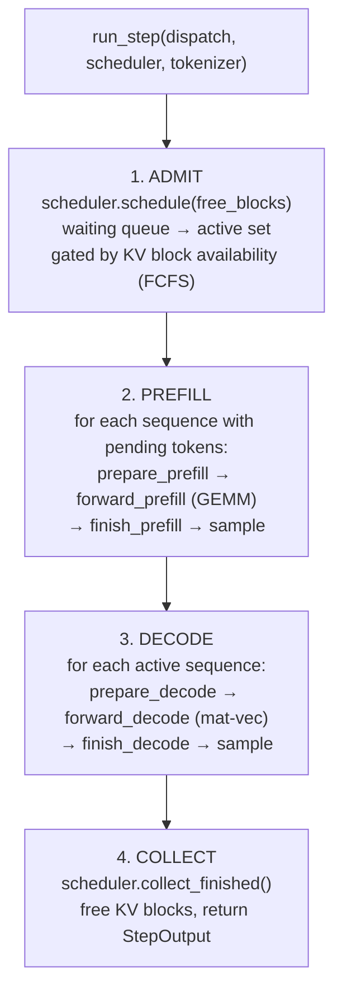
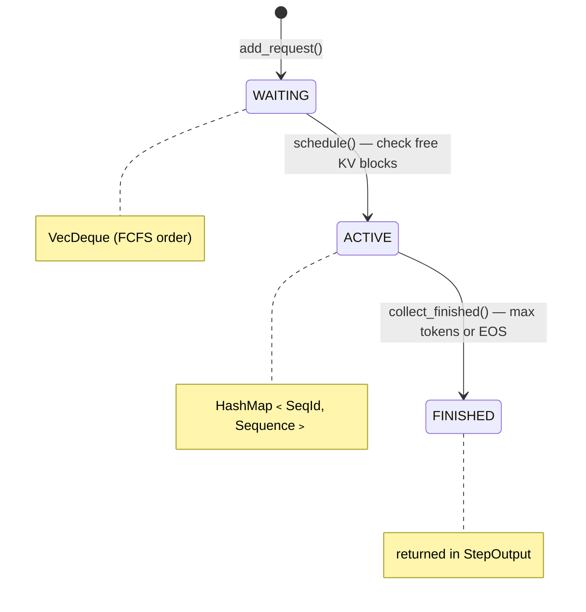

# Inference Engine

The inference engine is rLLM's core loop.  It manages scheduling, continuous
batching, and the prefill/decode execution phases.  All three entry points
(`run`, `batch`, `serve`) converge on the same engine interface.

**Key files:**
- `src/engine/mod.rs` — `Engine<B>`, `InferenceEngine` trait, `Scheduler`, `Sequence`, `run_step()`
- `src/engine/dispatch.rs` — `Dispatch` trait (abstracts single vs multi-GPU)
- `src/engine/multi_gpu.rs` — `MultiGpuEngine`, `MultiGpuDispatch`

---

## InferenceEngine Trait

The unified interface that all callers use:

```rust
pub(crate) trait InferenceEngine {
    fn add_request(&mut self, tokens: Vec<u32>, max_gen: usize,
                   temp: f32, top_p: f32) -> SeqId;
    fn step(&mut self) -> Result<StepOutput>;
    fn abort_sequence(&mut self, id: SeqId);
    fn has_work(&self) -> bool;
    fn tokenizer(&self) -> &Tokenizer;
}
```

Two implementations exist:
- `Engine<'a, B: GpuBackend>` — single-GPU, generic over backend
- `MultiGpuEngine` — multi-GPU tensor parallelism, wraps N CUDA backends

The caller never knows which implementation is active — `load_and_run()`
selects based on the `--tp` flag and returns `Box<dyn InferenceEngine>`.

---

## The Step Loop

Each call to `step()` executes one iteration of the inference loop via
`run_step()`, which is generic over `D: Dispatch`:



### Why separate prefill and decode?

| Phase | Operation | Bottleneck | Batch size |
|-------|-----------|-----------|------------|
| Prefill | GEMM (matrix × matrix) | Compute-bound | All prompt tokens at once |
| Decode | Mat-vec (matrix × vector) | Memory bandwidth-bound | 1 token per sequence |

Separating them allows using different kernel paths optimized for each
workload.  Prefill uses batched GEMM (`matmul_batch`); decode uses mat-vec
(`matmul`).

### Known Improvement Areas

- **Single-sequence decode loop** (high priority): Decode currently processes
  one sequence at a time.  Batching decode across concurrent sequences into a
  single padded mat-mul call would significantly improve GPU utilization at
  high concurrency.
- **Serial prefill** (low priority): Multiple concurrent prefills are processed
  sequentially.  While each individual prefill is already GEMM-batched, merging
  multiple prefills could amortize kernel launch overhead.

---

## Dispatch Trait

The `Dispatch` trait abstracts GPU-specific operations so the step loop can
be written once for both single and multi-GPU:

```rust
pub(crate) trait Dispatch {
    type SeqState;  // Per-sequence KV state

    fn prepare_prefill(&mut self, state: &mut Self::SeqState, count: usize) -> Result<()>;
    fn forward_prefill(&self, tokens: &[u32], state: &Self::SeqState) -> Result<()>;
    fn finish_prefill(state: &mut Self::SeqState, count: usize);

    fn prepare_decode(&mut self, state: &mut Self::SeqState) -> Result<()>;
    fn forward_decode(&self, token: u32, state: &Self::SeqState) -> Result<()>;
    fn finish_decode(state: &mut Self::SeqState);

    fn sample(&self, temp: f32, top_p: f32, rng: &mut impl Rng) -> Result<u32>;
    fn free_block_count(&self) -> usize;
}
```

| Implementation | `SeqState` | GPU ops |
|----------------|-----------|---------|
| `SingleGpuDispatch<'a, B>` | `SeqKvState<B>` | Direct calls to `Model<B>` |
| `MultiGpuDispatch` | `Vec<SeqKvState<CudaBackend>>` | Parallel dispatch to N GPUs, NCCL sync |

---

## Scheduler

The scheduler manages the lifecycle of inference sequences:



### Admission Policy

FCFS (first-come, first-served).  The scheduler checks whether enough free
KV blocks exist to hold the new sequence's prompt, and admits greedily:

```
blocks_needed = ceil(prompt_length / BLOCK_SIZE)
if free_blocks >= blocks_needed → admit
else → stay in waiting queue
```

There is no preemption — once a sequence is admitted, it holds its KV blocks
until completion.  This simplifies the design but means long sequences can
starve shorter ones under memory pressure.

### Sequence State

Each active sequence tracks:

| Field | Purpose |
|-------|---------|
| `pending_prefill` | VecDeque of tokens still to prefill |
| `kv_state` | Per-sequence KV cache state (block table) |
| `generated_tokens` | Tokens generated so far |
| `temperature` | Sampling temperature |
| `top_p` | Nucleus sampling threshold |
| `max_gen_tokens` | Generation limit |

A sequence is "finished" when it hits `max_gen_tokens` or generates an
end-of-sequence token.

---

## Continuous Batching

The engine implements continuous batching: sequences enter and leave the
active set independently, without waiting for a batch boundary.

Each `step()`:
- New sequences are admitted if KV blocks are available
- Prefill runs for newly admitted sequences
- Decode runs for all other active sequences
- Finished sequences are removed and their blocks freed immediately

This means the engine never waits for a "batch" to fill — it processes
whatever work is available each step, maximizing GPU utilization.

---

## Multi-GPU Engine

For tensor parallelism (`--tp N`), `MultiGpuEngine` wraps N `CudaBackend`
instances.  Each GPU holds a shard of the model weights (attention heads and
FFN columns split across ranks).  The `MultiGpuDispatch` type coordinates:

1. **Forward pass** — dispatched in parallel to all GPUs
2. **All-reduce** — NCCL `all_reduce_sum` after each attention and FFN layer
3. **Sampling** — performed on rank 0 only

The step loop is identical — only the `Dispatch` implementation changes.

---

## Design Patterns

### ID Collection (borrow-safe iteration)

The engine frequently needs to iterate over sequences and mutate them.  To
satisfy Rust's borrow checker without unsafe code:

```rust
let ids: Vec<SeqId> = scheduler.active.iter()
    .filter(|(_, seq)| seq.pending_prefill.is_empty())
    .map(|(&id, _)| id)
    .collect();

for id in ids {
    let seq = scheduler.active.get_mut(&id).unwrap();
    // mutate seq freely
}
```

### Callback-based ownership

`load_and_run()` keeps the backend and model on its stack, then passes
mutable references into the engine.  This satisfies Rust's lifetime rules
without `Arc<Mutex<>>` or heap allocation for the core inference path.

---

See also: [Architecture Overview](architecture-overview.md) ·
[KV Cache](kv-cache.md) · [Model Layer](model-layer.md)
