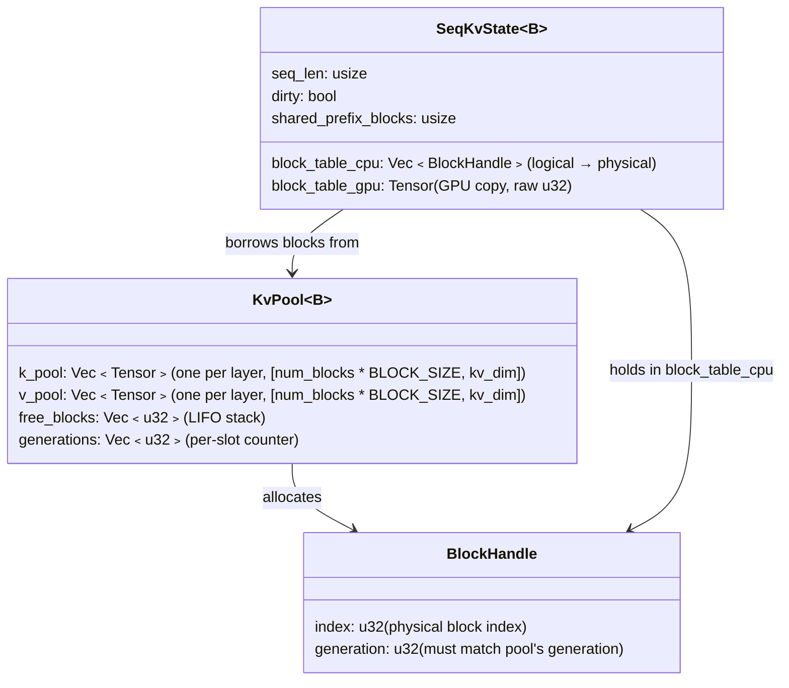
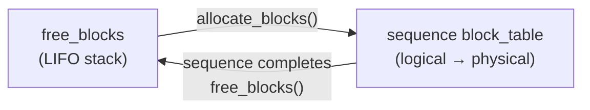

# KV Cache

The KV (key-value) cache stores attention keys and values from previous tokens,
avoiding recomputation during autoregressive generation.  rLLM uses a **paged**
KV cache inspired by vLLM's PagedAttention, where memory is allocated in
fixed-size blocks rather than contiguous per-sequence buffers.

**Key files:**
- `src/model/kv_cache.rs` — `KvPool<B>`, `SeqKvState<B>`, block allocation
- `src/engine/mod.rs` — scheduler admission based on free blocks
- `src/gpu/ops/attention.rs` — `GpuAttention` trait (paged attention kernel)

---

## Why Paged?

Without paging, each sequence pre-allocates a contiguous buffer for
`max_seq_len` tokens.  This wastes memory because:

- Most sequences are shorter than the maximum
- Memory can't be shared between sequences of different lengths
- Fragmentation grows as sequences finish at different times

Paging solves this by allocating **fixed-size blocks** (16 tokens each) on
demand.  A block table maps logical positions to physical blocks, similar
to virtual memory page tables.

---

## Architecture



### Constants

| Constant | Value | Rationale |
|----------|-------|-----------|
| `BLOCK_SIZE` | 16 tokens | Aligns with Metal threadgroup sizes and memory access patterns |
| Bytes per block (per layer) | `2 × BLOCK_SIZE × kv_dim × 2` | K + V, BFloat16 |

### Memory Formula

Total KV cache memory:
```
2 × num_layers × num_blocks × BLOCK_SIZE × kv_dim × sizeof(bf16)
```

For a 32-layer model with 1024 kv_dim and 2048 blocks:
```
2 × 32 × 2048 × 16 × 1024 × 2 bytes = ~4 GB
```

---

## Block Lifecycle



### Allocation

When a sequence needs more KV slots (during prefill or decode):

1. `ensure_slots(count)` checks if the current last block has room
2. If not, `alloc_block()` pops from `free_blocks` and returns a `BlockHandle`
   with the slot's current generation
3. The handle is appended to `block_table_cpu`
4. Sets `dirty = true` so the GPU copy is re-synced before the next kernel

### Deallocation

When a sequence finishes:

1. `free_sequence()` iterates the sequence's owned block handles (skipping
   shared prefix blocks)
2. Each `free_block(handle)` validates the handle's generation against the pool,
   increments the generation, and pushes the index back onto `free_blocks`
3. Any stale handle (wrong generation) panics immediately

---

## Admission Control

The scheduler gates admission on block availability:

```rust
fn can_admit(&self, prompt_len: usize) -> bool {
    let blocks_needed = blocks_needed_for(prompt_len);
    self.dispatch.free_block_count() >= blocks_needed
}

fn blocks_needed_for(tokens: usize) -> usize {
    (tokens + BLOCK_SIZE - 1) / BLOCK_SIZE  // ceiling division
}
```

This is **conservative** — it checks blocks for the entire prompt upfront.
Sequences that are admitted are guaranteed to have enough memory for their
prompt (though decode tokens allocate incrementally).

---

## Lazy GPU Sync

The block table is maintained on both CPU and GPU.  To avoid unnecessary
transfers:

1. `block_table_cpu` is the source of truth (modified during allocation)
2. `dirty` flag is set whenever `block_table_cpu` changes
3. Before a kernel that reads the block table, `sync_block_table_validated()`
   validates all handle generations, extracts raw `u32` indices, and uploads
   to `block_table_gpu`
4. If not dirty, the GPU copy is reused — no transfer or validation

This matters because decode adds at most one block per step, but the
attention kernel reads the block table every step.

---

## Paged Attention Kernel

The `GpuAttention::paged_attention()` kernel reads from the paged KV cache:

1. Receives the block table as an input tensor
2. For each attention head, iterates over filled blocks
3. Loads K/V vectors from physical block positions (not contiguous)
4. Computes scaled dot-product attention across all blocks
5. Writes the attention output

The block table indirection adds one level of pointer chasing compared to
contiguous KV, but the memory savings from paging far outweigh this cost.

---

## KV Cache Write

During prefill and decode, new K/V vectors are written to the cache:

- `GpuAttention::kv_cache_write()` — writes K and V for new tokens
- Uses `seq_len` to determine the write position within the block table
- After writing, `seq_len` is incremented

---

## Generational Indices

Block indices are capabilities — a `u32` that grants access to a region of the
KV pool.  If a block is freed and reallocated, any leftover reference silently
reads another sequence's KV data.  Rust's ownership model can't prevent this
because the pool is one long-lived buffer and block indices are just offsets.

`BlockHandle` pairs each index with a generation counter:

```rust
struct BlockHandle {
    index: u32,       // physical block index (what the GPU kernel uses)
    generation: u32,  // must match pool's current generation for this slot
}
```

The pool tracks a generation per slot.  Freeing increments it.  Any operation
on a stale handle panics:

```
alloc block 7   → BlockHandle { index: 7, generation: 0 }
free  block 7   → pool.generations[7] becomes 1, index 7 back on free list
alloc block 7   → BlockHandle { index: 7, generation: 1 }
free  old handle → generation 0 ≠ 1 → PANIC: "stale BlockHandle"
```

### Validation points

| Where | What | When |
|-------|------|------|
| `free_block(handle)` | Generation check | Every block free (sequence finish, cache eviction) |
| `sync_block_table_validated()` | All handles in block table | Before every GPU upload (prefill, decode) |

The validated sync is the last checkpoint before stale indices reach the GPU
attention kernel.  It catches the exact bug class that motivated this design:
prefix cache blocks freed while still referenced, then reallocated to a
different sequence.

### Cost

One `u32` comparison per block on free and sync.  No runtime cost on the GPU —
`sync_block_table_inner` extracts raw `handle.index` values for the kernel.
Generations live only on the CPU side.

---

## Comparison to Other Systems

| Feature | rLLM | vLLM | llama.cpp |
|---------|------|------|-----------|
| Allocation | Paged blocks | Paged blocks (PagedAttention) | Contiguous buffer |
| Block size | 16 tokens | Configurable (default 16) | N/A (no blocks) |
| Preemption | No | Yes (evict + re-prefill) | No |
| Prefix caching | Yes (hash + ref count) | Yes (share prefix blocks) | K-shift for RoPE |
| Defragmentation | No (LIFO reuse) | Yes (copy-on-write) | Recently added |

rLLM's paging is simpler than vLLM's — no preemption, no copy-on-write.
Prefix caching shares KV blocks across sequences with identical prefixes
via `PrefixCache` (hash lookup + reference counting + LRU eviction).
See [Prompt Caching](prompt-caching.md) for details.

---

See also: [Architecture Overview](architecture-overview.md) ·
[Inference Engine](inference-engine.md) · [GPU Backend](gpu-backend.md)
