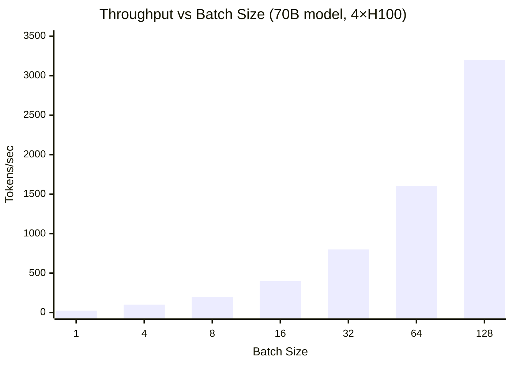
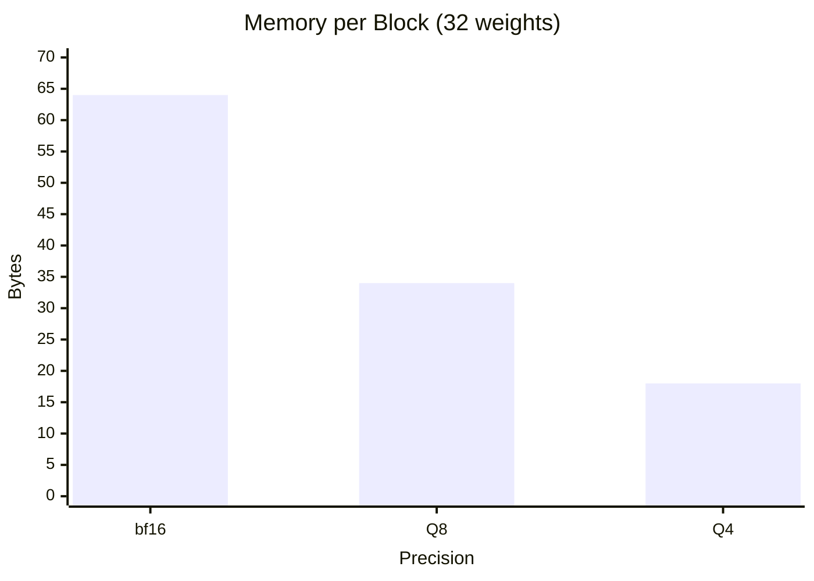
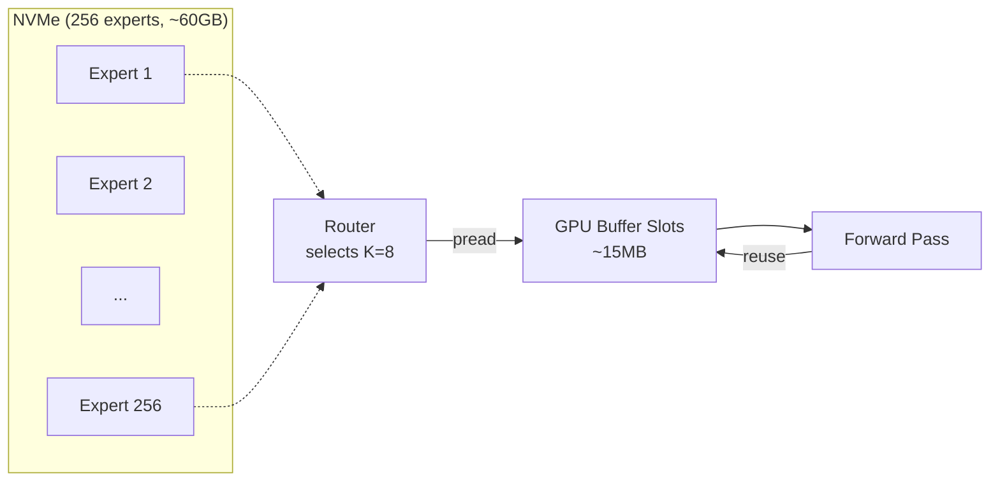
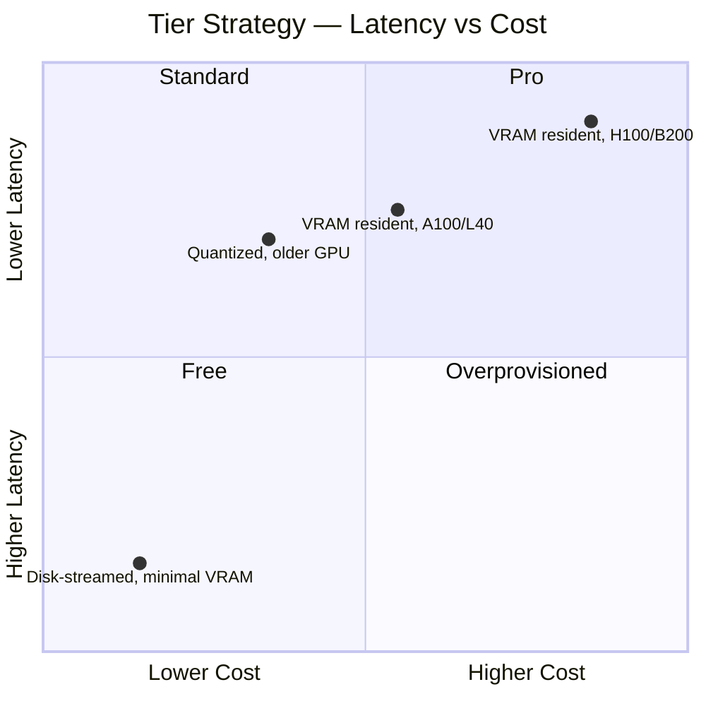
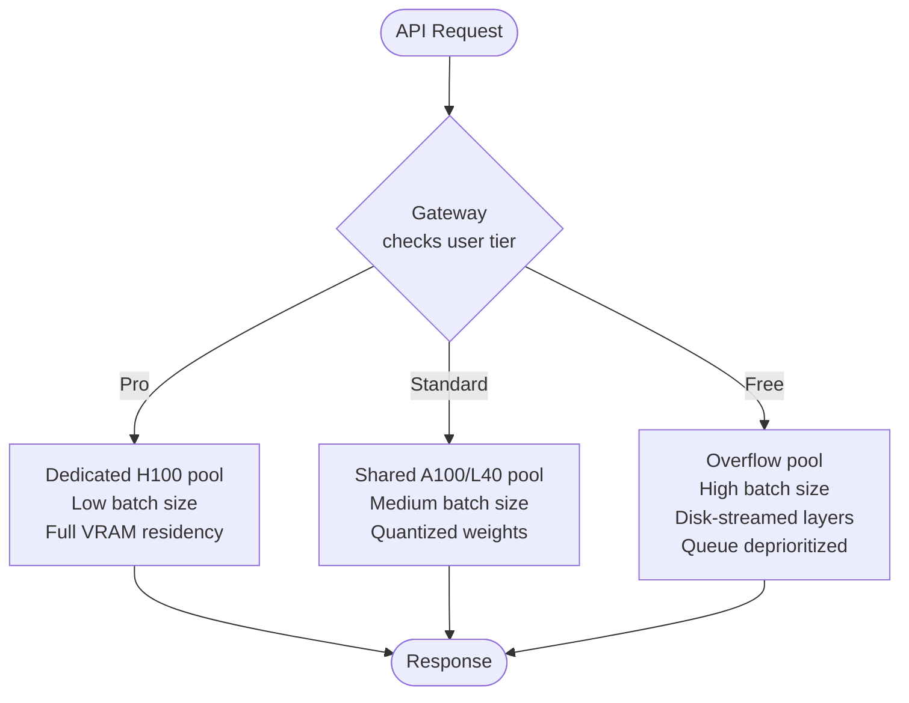
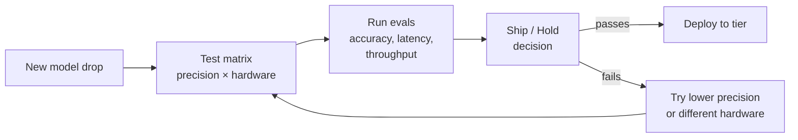

# Production Considerations

Notes on how LLM inference works at scale, based on building
[rLLM](https://github.com/JonCooperWorks/rLLM) and
[Dyson](https://github.com/JonCooperWorks/dyson).  One developer's mental
model, not a reference architecture.

---

## The Gateway

rLLM is a single-model inference server.  In production you'd run many
instances, each serving one model on one or more GPUs.  A gateway sits in
front and handles everything that isn't inference:

**Auth.**  Validate API keys, check model access, reject bad requests before
they reach a GPU.  Inference servers should not know about user identity.

**Billing.**  Token counts come back from the inference server; the gateway
records usage.  Streaming responses are metered as tokens arrive via SSE.

**Routing.**  Map the `model` field to a backend pool.  Balance via
round-robin, shortest queue, or prefix-cache affinity.

**Image fetching.**  For multimodal requests, fetch images from URLs and
convert to base64 before forwarding.  Eliminates SSRF on GPU machines.

---

## Batching

A single forward pass is memory-bandwidth-bound: the GPU reads every weight
matrix once per token.  Decoding one sequence at a time wastes compute.

**Continuous batching** packs N sequences into one forward pass — one
[N, hidden] × [hidden, vocab] GEMM instead of N mat-vec ops.  Same weight
read, N tokens of output.  A 70B on 4×H100s decodes at ~40ms for one user;
with batching, the same latency serves 32–128 concurrent sequences.

Prefill is compute-bound and parallelizes naturally.  Decode is where
batching matters — and where the economics live.

---

## Quantization

Quantization compresses weights — rLLM's Q4 packs 32 weights into 18 bytes
(vs 64 at bf16), cutting memory bandwidth ~4× and directly increasing decode
throughput ~4× (since decode is bandwidth-bound).

**"Small" models are often quantized large ones.**  A 70B at Q4 fits in the
same memory as a 20B at bf16 and often performs comparably.

**Mixed precision.**  Attention projections are more sensitive than FFN
weights.  Keep sensitive layers higher, quantize the rest.

**Production runs at the lowest precision that passes eval.**  Every bit
shaved is less bandwidth, more sequences per GPU, lower cost per token.  The
model behind an API is almost certainly not at training precision.

---

## Disk Streaming

Not every model has to fit in GPU memory.  rLLM already streams MoE experts
from NVMe on demand (`src/model/expert_stream.rs`) — Qwen3.5-35b has 256
experts (~60GB), but only 8 are active per token, so expert memory drops from
60GB to ~15MB of buffer slots.

The same idea generalizes to dense models.  A 70B at Q4 is ~35GB.  A machine
with 24GB of VRAM can run it by streaming layers from disk — load a few
transformer blocks, run them, evict, load the next batch.  Latency goes up
(NVMe-bound instead of VRAM-bandwidth-bound), but the model runs.

---

## Economics and Tier Differentiation

Unit economics: how many tokens per GPU-hour, and what do you charge per
token?

**Batching is the business model.**  An H100 at ~$2–3/hr decoding one
sequence produces ~25 tok/s.  Batching 64 sequences produces ~1600 tok/s from
the same hour — 64× lower cost per token.

**Quantization is pure margin.**  Q4 vs bf16 is ~4× more tokens per GPU-hour
at nearly the same quality.  Charge the same price: 4× margin.  Pass savings
to users: undercut competitors.

**Tiers are a mix of hardware, quantization, residency, and priority.**

Same model, same API, different hardware behind it.  Pro users get dedicated
GPU pools with low batch sizes and aggressive latency SLOs.  Free users get
overflow pools on older hardware, high batch sizes, disk-streamed models, and
lower queue priority.  The GPU does the same work — the difference is queue
position and how much of the model lives in VRAM.

**Smaller models are genuinely cheap.**  A 7B fits on a consumer GPU; a 70B
needs 4×H100s.  10–50× cost difference.  The large-model premium pays for the
fleet.

---

## QA and Eval

The question: "which models, at which precisions, on which hardware, pass the
quality bar?"

**What providers likely have.**  CI/CD for models — spin up servers for each
model + quantization + hardware combo, run evals (accuracy, latency
percentiles, throughput under load), produce reports: "Llama 70B Q4 on
2×A100: passes quality bars, 35ms/tok p50, $X/M tokens — ship it."

**What I have.**  Scripts I run manually on rented GPUs: prompt suite
(reasoning, code, chat, tool calling), expected-output checks, latency/
throughput measurement, cross-run comparison.

A proper eval framework is a separate project — rLLM is the inference engine,
not the orchestration layer.

---

## What This Means for rLLM

rLLM is the inference server box in the diagram: model loading, Q4
quantization, continuous batching, GPU dispatch, streaming generation, and an
OpenAI/Anthropic-compatible API.

Everything above — auth, billing, routing, tiers — belongs in a gateway.
rLLM turns tokens into tokens.  The gateway decides which tokens go where and
who pays.
