# Production Considerations

Notes on how LLM inference works at scale, based on building
[rLLM](https://github.com/JonCooperWorks/rLLM) and
[Dyson](https://github.com/JonCooperWorks/dyson).  One developer's mental
model, not a reference architecture.

---

## The Gateway

rLLM is a single-model inference server.  In production you'd run many
instances, each serving one model on one or more GPUs.  A gateway sits in
front and handles everything that isn't inference:


**Auth.**  Validate API keys, check model access, reject bad requests before
they reach a GPU.  Inference servers should not know about user identity.

**Billing.**  Token counts come back from the inference server; the gateway
records usage.  Streaming responses are metered as tokens arrive via SSE.

**Routing.**  Map the `model` field to a backend pool.  Balance via
round-robin, shortest queue, or prefix-cache affinity.

**Image fetching.**  For multimodal requests, fetch images from URLs and
convert to base64 before forwarding.  Eliminates SSRF on GPU machines.

---

## Batching

A single forward pass is memory-bandwidth-bound: the GPU reads every weight
matrix once per token.  Decoding one sequence at a time wastes compute.

**Continuous batching** packs N sequences into one forward pass — one
[N, hidden] × [hidden, vocab] GEMM instead of N mat-vec ops.  Same weight
read, N tokens of output.  A 70B on 4×H100s decodes at ~40ms for one user;
with batching, the same latency serves 32–128 concurrent sequences.

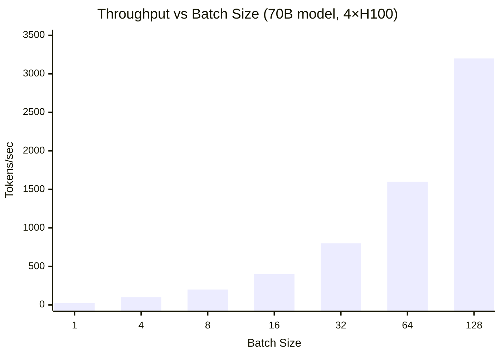

Prefill is compute-bound and parallelizes naturally.  Decode is where
batching matters — and where the economics live.

---

## Quantization

Quantization compresses weights — rLLM's Q4 packs 32 weights into 18 bytes
(vs 64 at bf16), cutting memory bandwidth ~4× and directly increasing decode
throughput ~4× (since decode is bandwidth-bound).

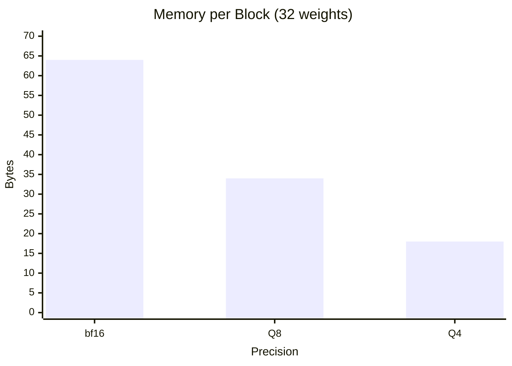

**"Small" models are often quantized large ones.**  A 70B at Q4 fits in the
same memory as a 20B at bf16 and often performs comparably.

**Mixed precision.**  Attention projections are more sensitive than FFN
weights.  Keep sensitive layers higher, quantize the rest.

**Production runs at the lowest precision that passes eval.**  Every bit
shaved is less bandwidth, more sequences per GPU, lower cost per token.  The
model behind an API is almost certainly not at training precision.

---

## Disk Streaming

Not every model has to fit in GPU memory.  rLLM already streams MoE experts
from NVMe on demand (`src/model/expert_stream.rs`) — Qwen3.5-35b has 256
experts (~60GB), but only 8 are active per token, so expert memory drops from
60GB to ~15MB of buffer slots.

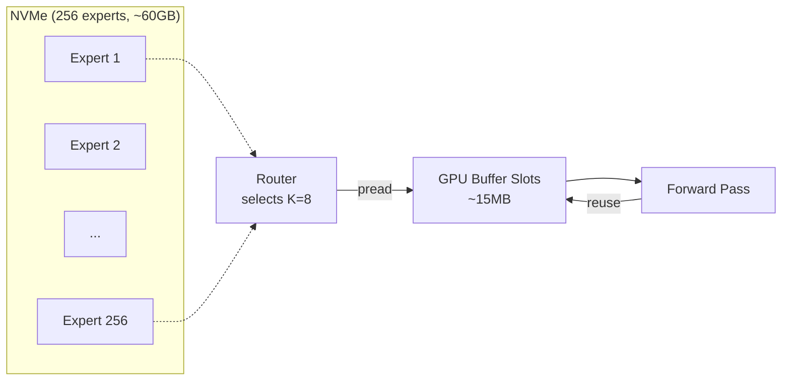

The same idea generalizes to dense models.  A 70B at Q4 is ~35GB.  A machine
with 24GB of VRAM can run it by streaming layers from disk — load a few
transformer blocks, run them, evict, load the next batch.  Latency goes up
(NVMe-bound instead of VRAM-bandwidth-bound), but the model runs.

---

## Prompt Caching

Most API traffic shares a common prefix.  System prompts, tool definitions,
and few-shot examples appear identically at the start of every request for a
given integration.  Prompt caching exploits this: compute the KV once, share
the physical blocks across all subsequent requests.

### The mechanism

rLLM's paged KV cache already uses block-table indirection — each sequence has
a block table mapping logical blocks to physical blocks in a shared pool.
Prompt caching extends this with a `PrefixCache` that maps token-sequence
hashes to physical block indices:

```
Request 1 (first with this system prompt):
  prefill all 1024 tokens → writes blocks [0..63]
  register blocks [0..63] in PrefixCache, key = hash(tokens[0..1024])

Request 2 (same system prompt + different user message):
  lookup hash(tokens[0..1024]) → hit, blocks [0..63]
  copy [0..63] into new seq's block table, set seq_len = 1024
  prefill only the 50 suffix tokens → writes blocks [64..67]
```

The attention kernel sees a contiguous 1074-position sequence.  It doesn't
know that blocks 0–63 were computed by a different request.  The block table
abstraction makes sharing transparent.

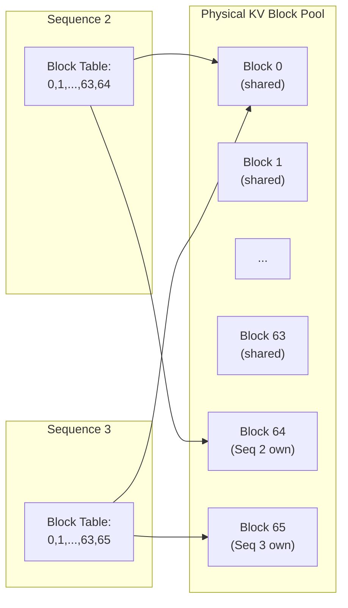

Reference counting ensures shared blocks survive until all users are done.
Eviction is LRU among entries with zero active references.

### The economics

Prompt caching saves **prefill compute** — the most expensive per-request
cost.  Prefill is compute-bound (GEMM through every transformer layer for
every prompt token).  For a 70B model on 4×H100, prefilling 1000 tokens takes
~200ms.  Cache that prefix and subsequent requests skip it entirely.

The numbers:

| Metric | Without cache | With cache (90% hit) |
|--------|--------------|---------------------|
| Prefill per request | 1000 tokens | 100 tokens (suffix only) |
| TTFT (time to first token) | ~200 ms | ~20 ms |
| Prefill compute/request | ~200 TFLOP | ~20 TFLOP |
| Max prefills/sec (compute-limited) | ~5 | ~50 |

**Prefill throughput scales inversely with prefix length.**  A 4000-token
system prompt (common for tool-calling agents) takes ~800ms to prefill.  Cache
it and TTFT drops to the user-message prefill time — typically 10–50ms.

**Memory trade-off.**  Cached blocks consume VRAM that could hold more
concurrent sequences.  A 1000-token prefix at kv_dim=1024, bf16, 32 layers
costs `63 blocks × 16 × 1024 × 2 × 2 × 32 = ~128 MB`.  On a 80GB H100, that's
0.16% of VRAM for a cache entry that might serve thousands of requests.

**The pricing angle.**  Anthropic charges cached input tokens at a 90%
discount (10% of base price).  This works because the provider's marginal cost
for a cached token is near zero — the KV already exists in GPU memory.  The
discount incentivises users to structure prompts for cacheability (stable
system prompt first, variable content last), which improves GPU utilisation
for the provider.

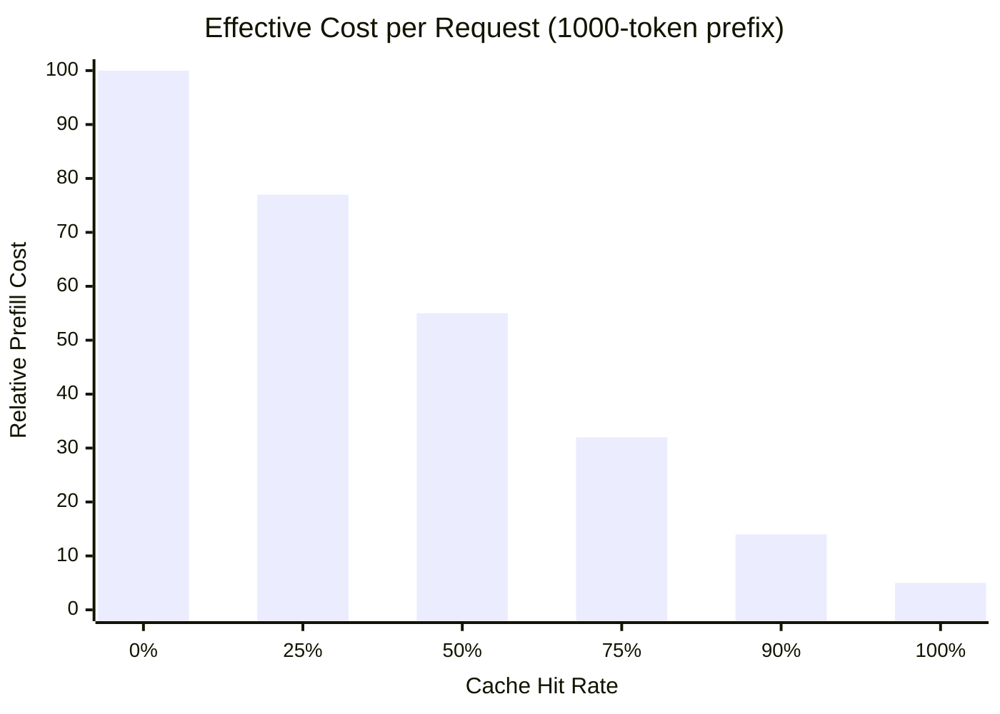

At 90% hit rate, prefill cost per request drops to ~14% of the uncached
baseline.  The remaining cost is the suffix prefill (always required) plus
the decode phase (unaffected by caching).

**What caching does NOT improve.**  Decode throughput (tok/s) is unchanged —
each generated token still requires a full forward pass through all layers,
reading the entire KV cache.  Caching is purely a TTFT and prefill-compute
optimisation.

---

## Prefix-Cache Routing

The prefix cache is **local to each engine instance** — an in-process hash map
with no cross-server coordination.  A request only hits a cached prefix if it
lands on the server that computed it.  This makes load-balancer routing the
single biggest lever for cache hit rate.

### Routing strategies

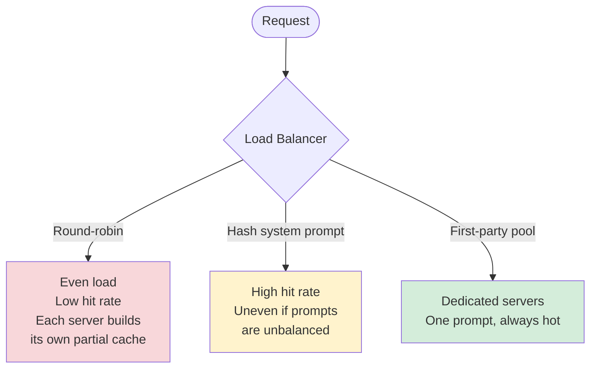

**Round-robin** — Even load, but every server independently caches the same
prefixes.  N servers means N× the VRAM spent on duplicate cache entries and N×
the cold prefills.  Fine for low-volume or heterogeneous traffic where no prefix
dominates.

**Hash on system prompt** — Hash the system prompt content (or a stable prefix
of it) and use it as the routing key.  All requests with the same system prompt
land on the same server(s).  High cache hit rate, and naturally groups traffic
by integration rather than by user.  The risk is hot spots if one prompt
dominates — mitigate with consistent hashing across a small pool per prompt.

**Dedicated first-party pools** — The highest-leverage pattern.  First-party
clients (mobile app, web app, internal tools) all share a single system prompt
that you control.  Route them to a dedicated server pool where that prefix is
always hot.  The prefix never competes with other entries for cache slots and
never gets evicted.

### The first-party / API split

In practice, traffic splits into two categories with very different caching
profiles:

```
First-party clients          API customers
─────────────────           ──────────────
You control the prompt       They control the prompt
One system prompt            One per customer (mostly stable)
100% cache hit rate          High hit rate with affinity routing
Dedicated server pool        Shared pool, hash-routed
```

**First-party clients** are the easy case.  You wrote the system prompt, it
never changes mid-session, and every request from every user starts with the
exact same tokens.  A dedicated pool of 2–4 servers with sticky routing gives
near-100% cache hit rate.  The system prompt's KV blocks are computed once at
first request and stay resident indefinitely.

**API customers** converge on the same pattern organically.  Each customer
typically has one or a few system prompts (one per app they've built).  Route
by API key or by hash of the system prompt and each customer's prefix stays
warm on their assigned servers.  The pricing incentive reinforces this:
charging cached input tokens at a discount (e.g., Anthropic's 90% discount)
nudges API users toward stable, cacheable system prompts — which improves
GPU utilisation for the provider.  A virtuous cycle.

### Why this works economically

System prompts are simultaneously:
- **The longest part** of the input (hundreds to thousands of tokens of
  instructions, tool schemas, few-shot examples)
- **The most repetitive** (identical across every request from the same client)
- **The most expensive to compute** (prefill is compute-bound, cost scales
  with prompt length)

Caching the thing that is longest, most repetitive, and most expensive to
compute gives the biggest return.  A 4000-token system prompt at ~800ms
prefill, cached at 90% hit rate, saves ~720ms of GPU compute per request.
At 100 req/s that's 72 seconds of GPU time saved per second of wall time —
the equivalent of adding 72 GPUs worth of prefill capacity for free.

### Capacity planning

The default cache holds 64 prefixes per instance.  In the first-party pool
pattern, you only need one slot.  In the API pattern, 64 slots covers your
top 64 API customers by traffic — which likely accounts for 95%+ of requests
(API traffic follows a power law).

The real constraint is VRAM.  Each cached prefix holds KV blocks that can't
be used for active sequences.  A 1000-token prefix costs ~128MB at typical
dimensions.  64 cached prefixes = ~8GB — significant on a 24GB card, negligible
on an 80GB H100.  Size the cache to the hardware.

---

## Economics and Tier Differentiation

Unit economics: how many tokens per GPU-hour, and what do you charge per
token?

**Batching is the business model.**  An H100 at ~$2–3/hr decoding one
sequence produces ~25 tok/s.  Batching 64 sequences produces ~1600 tok/s from
the same hour — 64× lower cost per token.

**Quantization is pure margin.**  Q4 vs bf16 is ~4× more tokens per GPU-hour
at nearly the same quality.  Charge the same price: 4× margin.  Pass savings
to users: undercut competitors.

**Prompt caching is throughput multiplication.**  The GPU cycles saved on
prefill are available for more decode batches.  A workload that's 60% prefill-bound
(long system prompts, short responses) can nearly double effective throughput
with a hot cache — same hardware, same price, 2× the requests served.

**Tiers are a mix of hardware, quantization, residency, caching, and priority.**

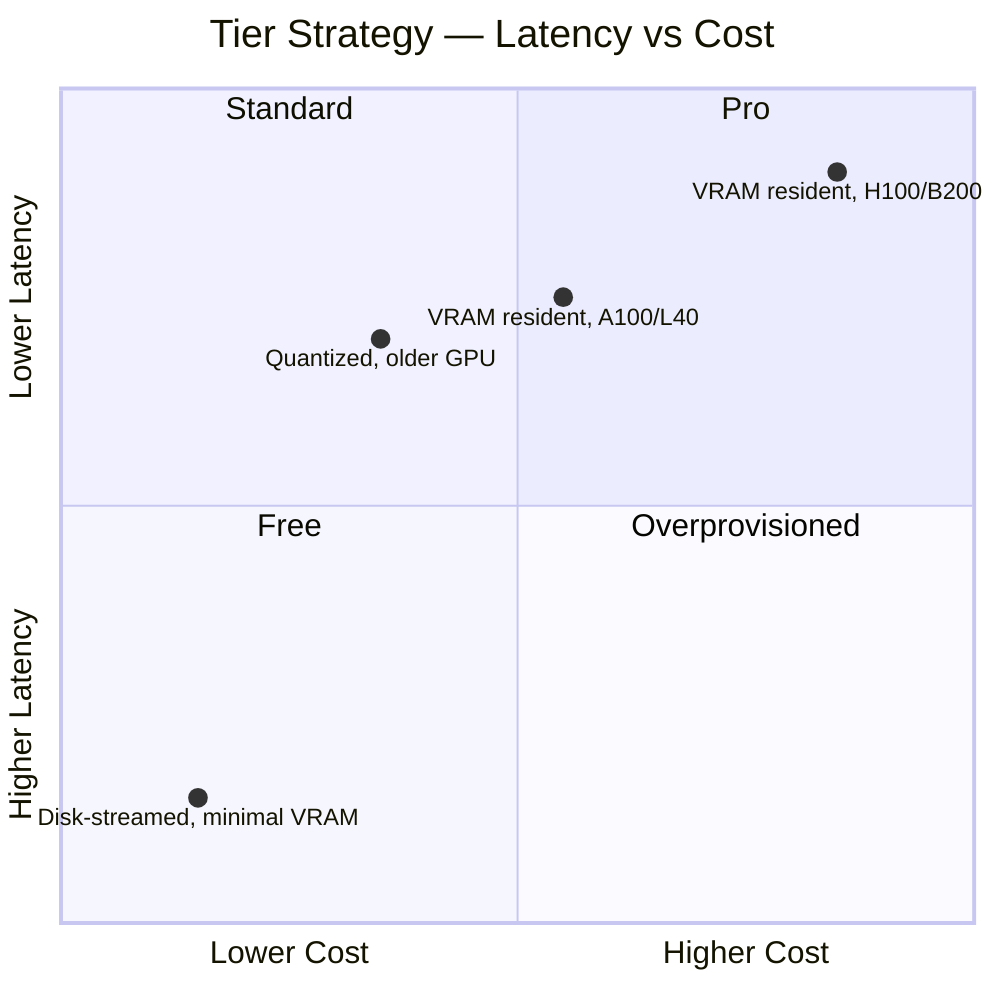

Same model, same API, different hardware behind it.  Pro users get dedicated
GPU pools with low batch sizes and aggressive latency SLOs.  Free users get
overflow pools on older hardware, high batch sizes, disk-streamed models, and
lower queue priority.  The GPU does the same work — the difference is queue
position and how much of the model lives in VRAM.

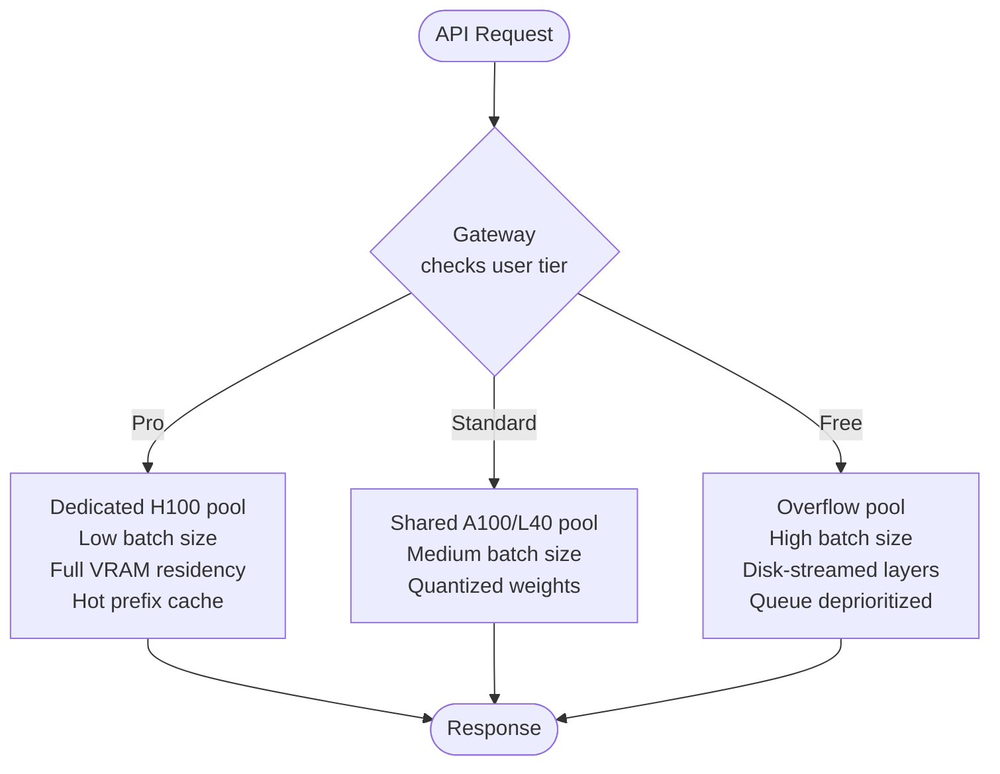

**Smaller models are genuinely cheap.**  A 7B fits on a consumer GPU; a 70B
needs 4×H100s.  10–50× cost difference.  The large-model premium pays for the
fleet.

**Prefix-cache affinity routing.**  The gateway routes requests to the server
that already has the system prompt cached.  See [Prefix-Cache
Routing](#prefix-cache-routing) above for strategies (dedicated first-party
pools, hash-based API routing, and why the economics create a virtuous cycle).

---

## QA and Eval

The question: "which models, at which precisions, on which hardware, pass the
quality bar?"

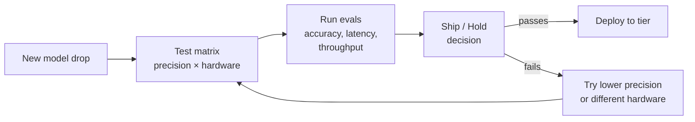

**What providers likely have.**  CI/CD for models — spin up servers for each
model + quantization + hardware combo, run evals (accuracy, latency
percentiles, throughput under load), produce reports: "Llama 70B Q4 on
2×A100: passes quality bars, 35ms/tok p50, $X/M tokens — ship it."

**What I have.**  Scripts I run manually on rented GPUs: prompt suite
(reasoning, code, chat, tool calling), expected-output checks, latency/
throughput measurement, cross-run comparison.

A proper eval framework is a separate project — rLLM is the inference engine,
not the orchestration layer.

---

## Security Controls

Inference servers hold the model weights and produce raw completions — two
things worth protecting.  The security model treats the inference fleet as a
high-value, low-surface-area zone: no direct internet, no user identity beyond
a scoped token, and every forward pass attributable to a customer.


### Authentication and token exchange

The gateway doesn't forward raw API keys to the inference server.  Instead,
it performs a token exchange: validate the customer's API key, mint a
short-lived, customer-scoped inference token, and attach it to the request.
The inference server verifies the token before running a forward pass.

This achieves three things:

1. **Identity at the inference layer.**  Every forward pass is tied to a
   customer identity, not just a gateway session.
2. **Token theft detection.**  If inference activity appears for a customer
   with no active gateway session (no recent API calls, no open SSE streams),
   something is wrong — either a stolen token or a compromised server.
3. **Blast radius.**  A leaked inference token expires quickly and only
   authorises inference, not billing mutations or account changes.

The inference server may refuse to initiate a forward pass without a valid
customer-scoped token.  This means even a compromised server that somehow
bypasses the gateway cannot generate tokens without a credential — defense
in depth.

### Audit logging

Every inference request is logged with customer identity, model, token
counts (prompt + completion), latency, and timestamp.  The audit log is the
ground truth for:

- **Billing reconciliation.**  Compare inference-side token counts against
  gateway-side billing records.  Discrepancies (inference tokens ≠ billed
  tokens) flag bugs or fraud.
- **Abuse detection.**  Unusually high token volumes for a customer, requests
  at odd hours, or patterns inconsistent with their integration's profile.
- **Forensics.**  If a model produces harmful output, trace it back to the
  exact request, customer, and input.

Both the gateway and inference server emit events to a **log gateway**
within the private VPC.  The log gateway is the only component that
forwards logs off-VPC to a central log store (corporate SIEM, data
warehouse, etc.).  Inference servers never talk to the central store
directly — they ship events to the VPC-local log gateway and nothing else.
Cross-referencing the two streams (inference-side and gateway-side) at the
central store catches discrepancies that either side alone would miss.

### Network isolation

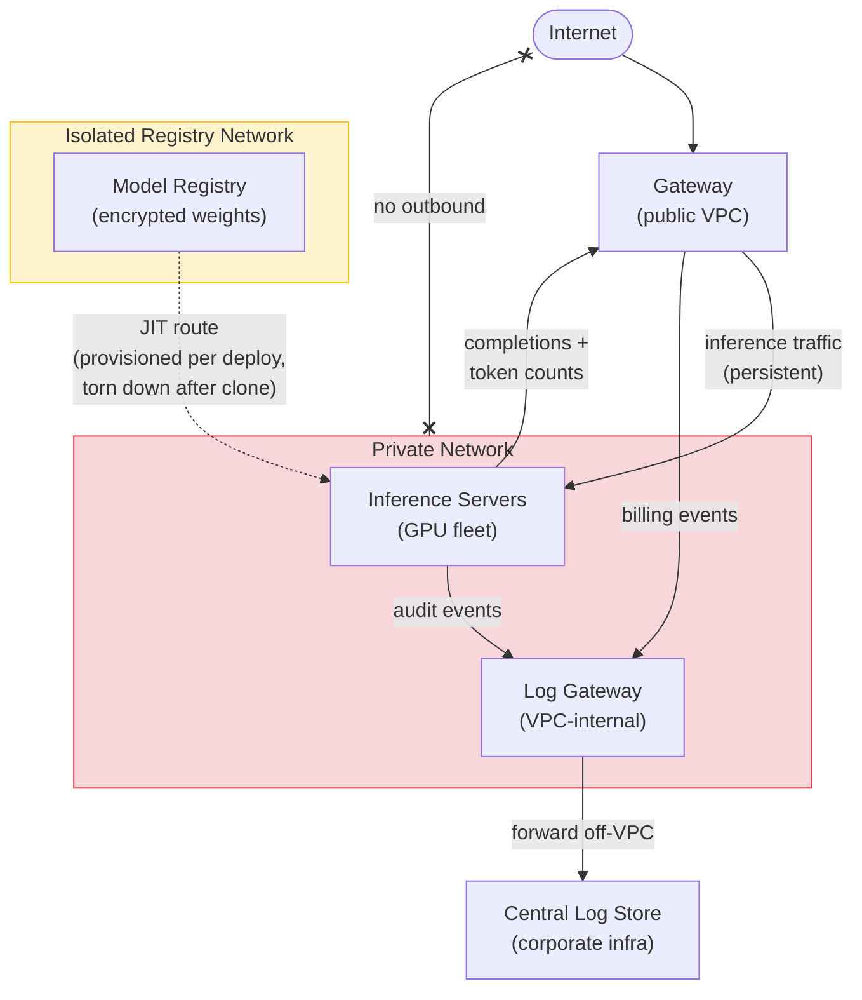

Inference servers live on a private network with **no standing outbound
network access** — not even to the model registry.  The only persistent
traffic flow is inference to/from the gateway (prompts in, completions out).

**JIT registry access.**  When an inference server needs to pull weights
(new model deploy, scale-up event), a short-lived outbound route to the
internal model registry is provisioned, the weights are cloned to local
NVMe, and the route is removed.  The server has no ability to reach the
registry (or anything else) outside of that window.  Provisioning the route
requires the same two-person approval as any other connectivity change —
an engineer requests it, a peer signs off, and the access is time-limited
and auto-revoked.

**Hardware-backed approval.**  All connectivity and access changes require
physical YubiKey authentication from the approving engineers.  A
compromised laptop or stolen session token isn't enough — someone has to
physically tap a key.

This minimises the exfiltration surface to the narrowest possible window.
A compromised inference server can't phone home, can't reach external APIs,
can't reach the model registry, and can't leak weights or outputs to the
internet.  The gateway is the sole persistent ingress/egress point for the
entire inference fleet.

### Weight protection

Model weights are intellectual property (for fine-tuned or proprietary
models) and an attack target (for model extraction).  Protection is handled
entirely at the infrastructure layer — the inference server never sees
ciphertext and has no crypto responsibilities.

**Registry-level encryption.**  Weights are stored in an internal
HuggingFace-style model registry, encrypted at rest.  Decryption keys are
accessible only to inference server service accounts and authorised
engineers.  No one else — not the gateway, not the tool cluster, not other
services — can read weights.  During the JIT registry access window, the
server clones and decrypts weights to local NVMe, then the route is torn
down.

**Full-disk encryption.**  The inference server's NVMe is encrypted at the
OS/infra layer (LUKS, FileVault, cloud-managed encrypted volumes with a
KMS key bound to the server's service account).  The filesystem presents
decrypted reads transparently — rLLM just calls `mmap` or `pread` and gets
bytes.  This means expert streaming (`pread` of individual tensors from
NVMe) works without any application-level crypto, which is critical for
large MoE models where only a few experts are active per token.

**Access control is the real protection.**  Encryption at rest protects
against physical disk theft and cloud-provider-level access.  The more
meaningful control is limiting who and what can reach the box at all: the
private network has no internet, the only service that can reach the
inference port is the gateway, and there is **no standing SSH access**.

Shell access to inference servers is behind a break-glass process: an
engineer opens a PR requesting access, a second engineer approves it, and
only then is a short-lived SSH session provisioned.  Two-person rule — no
one gets a shell on a machine holding model weights without a peer signing
off.  Sessions are logged, time-limited, and auto-revoked.  The default
state of the fleet is zero human access.  Even if an attacker gets the
disk encryption key, they can't reach the machine to use it.

**Why encryption doesn't belong in the inference engine.**  Embedding
key management, KMS SDKs, and decryption into the inference server would
add complexity to a hot path, kill `mmap`/`pread`-based weight loading,
and couple the inference binary to a specific cloud provider's KMS.  The
OS-level approach is transparent to the application, supports key rotation
without redeploying the inference server, and works with any weight-loading
strategy including expert streaming.

### Traffic volume monitoring

Outbound traffic volume from inference servers is monitored and compared
against the token counts in the audit log.  The expected bytes out for a
given number of completion tokens is predictable (tokens × ~4 bytes for
token IDs, plus SSE framing overhead).

Unexpected volume — significantly more bytes than the token count warrants —
triggers alerts.  This catches weight exfiltration attempts (weights are
large — a 70B Q4 is ~35GB), unauthorised bulk inference, or a compromised
server streaming data to an attacker via an allowed egress path.

---

## Server-Side Tools

Tool and function calling — web search, code execution, retrieval,
calculators — looks like it runs on the inference server, but it doesn't.
The inference server's job is to produce a tool-call response (a structured
JSON output saying "call function X with args Y").  Actually executing the
tool is someone else's problem.

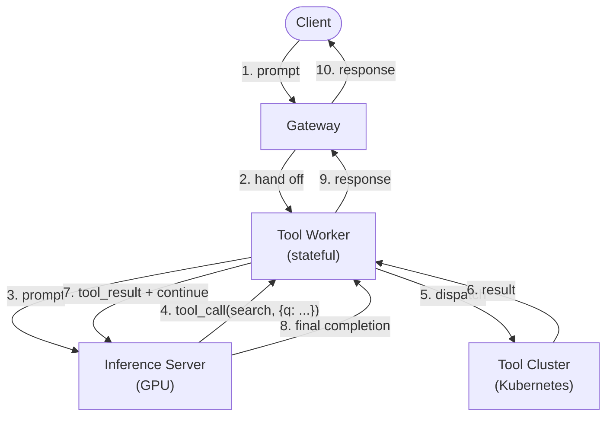

The **gateway hands off tool-call requests to a worker** so it doesn't get
bogged down.  When a request includes tools, the gateway spawns (or assigns)
a **tool worker** — a lightweight, stateful process that owns the
multi-round-trip loop.  The worker talks to the inference server, dispatches
tool calls to an isolated tool cluster, feeds results back, and repeats
until the model produces a final completion.  The gateway stays free for
routing, auth, and billing.  The inference server never talks to the tool
cluster directly.

### Why isolate tool execution

**Different compute profile.**  Inference servers are GPU-bound and
expensive.  Tool execution is CPU/memory-bound — web search, database
lookups, code sandboxes.  Running tools on GPU machines wastes $2–3/hr
hardware on work that a $0.10/hr container can do.

**Different security profile.**  Tools may need network access (web search
hits the internet), filesystem access (code execution), or database
credentials (retrieval).  Inference servers have none of these — they sit on
a locked-down private network with no outbound internet.  Mixing the two
profiles weakens the inference server's security posture.

**Independent scaling.**  Tool traffic is bursty and unpredictable (a
retrieval call might take 50ms or 5s depending on the backend).  The tool
cluster scales on CPU and memory via Kubernetes autoscaling.  The inference
cluster scales on GPU availability and batch utilisation.  Coupling them
means one bottlenecks the other.

**Blast radius.**  A tool that crashes, hangs, or times out affects one step
of one request.  The gateway retries or returns an error to the model.  If
the same tool ran on the inference server, a hang could block a GPU, stall a
batch, and degrade latency for every concurrent user.

### Worker-based orchestration

The tool worker is the agent-loop orchestrator — not the gateway.  For a
single user request, the worker may make multiple round trips between
inference and tools:

```
Gateway → worker → inference → tool_call → tool cluster → tool_result →
inference → tool_call → tool cluster → tool_result →
inference → final completion → worker → gateway → client
```

Each round trip adds latency (~100ms worker overhead + tool execution time),
but the alternative — giving inference servers network access and tool
credentials — breaks the security model.

**Policy enforcement is split.**  The **gateway** enforces per-customer
policies before handing off: **tool allow-lists** (customer X can use tools
A and B but not C) and **rate limits**.  The **tool worker** enforces
per-request limits during the loop: **max tool calls** (at most N round
trips), **per-tool timeouts** (tool must respond within T seconds), and
**loop deadlines** (total wall-clock cap across all round trips).  The
inference server just produces tool-call JSON and doesn't know or care
whether the tool actually runs.

---

## What This Means for rLLM

rLLM is the inference server box in the diagram: model loading, Q4
quantization, continuous batching, GPU dispatch, streaming generation, and an
OpenAI/Anthropic-compatible API.

Everything above — auth, billing, routing, tiers — belongs in a gateway.
rLLM turns tokens into tokens.  The gateway decides which tokens go where and
who pays.
