# Production Considerations

How LLM inference works at scale.  Based on building
[rLLM](https://github.com/JonCooperWorks/rLLM) and
[Dyson](https://github.com/JonCooperWorks/dyson).  One developer's mental
model, not a reference architecture.

---

## The Gateway

rLLM is a single-model inference server.  In production you run many
instances — one model per process, one or more GPUs per instance.  A gateway
sits in front and owns everything that isn't inference:

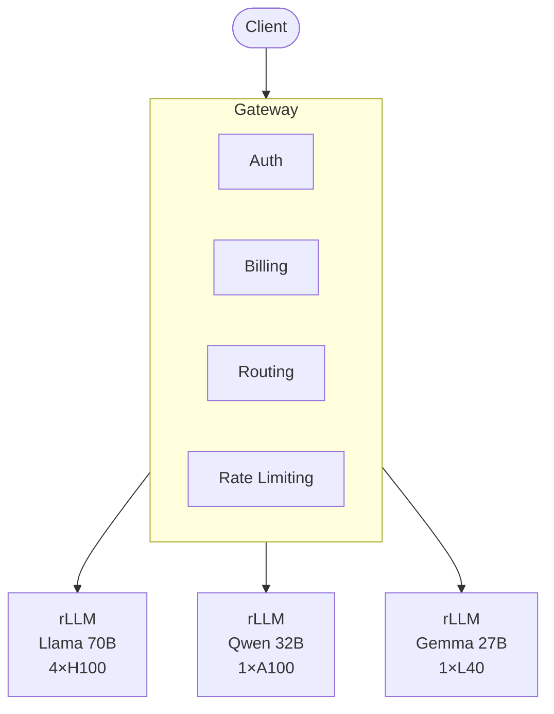

- **Auth** — validate API keys, check model access, reject bad requests before
  they touch a GPU
- **Billing** — record token counts as they stream back via SSE
- **Routing** — map the `model` field to a backend pool; balance via
  round-robin, shortest queue, or prefix-cache affinity
- **Image fetching** — for multimodal requests, fetch images from URLs and
  convert to base64 before forwarding; eliminates SSRF risk on GPU machines

---

## Batching

> See [Inference Engine](inference-engine.md) for rLLM's continuous batching
> implementation and step loop.

A single forward pass is memory-bandwidth-bound: the GPU reads every weight
once per token.  Decoding one sequence at a time wastes compute.

**Continuous batching** packs N sequences into one forward pass — one
[N, hidden] × [hidden, vocab] GEMM instead of N mat-vec ops.  Same weight
read, N tokens of output.

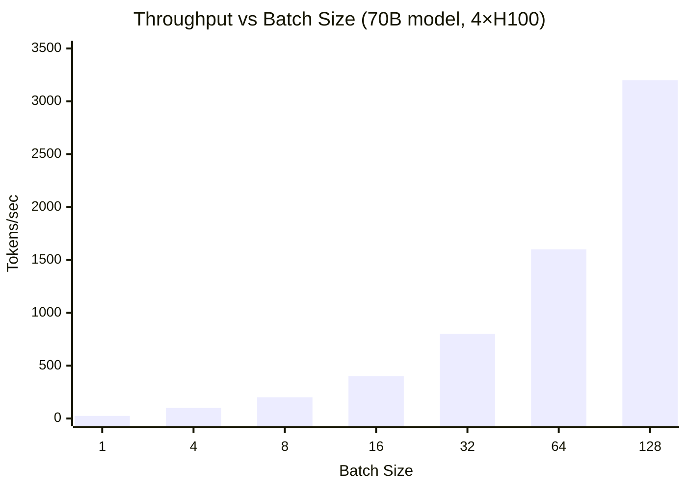

Prefill is compute-bound and parallelizes naturally.  Decode is where
batching matters — and where the economics live.

---

## Quantization

> See [Quantization](quantization.md) for the Q4 format spec, kernel
> internals, and pre-quantization workflow.

Quantization compresses weights.  rLLM's Q4 packs 32 weights into 18 bytes
(vs 64 at bf16) — ~4× less bandwidth, ~4× faster decode (decode is
bandwidth-bound).

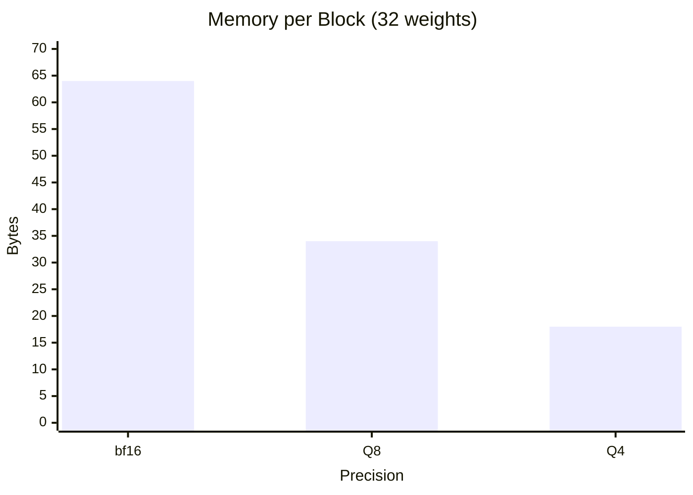

A 70B at Q4 fits in the same memory as a 20B at bf16 and often performs
comparably.  Production runs at the lowest precision that passes eval — every
bit saved is more sequences per GPU.

---

## Disk Streaming

> See [Expert Streaming](expert-streaming.md) for the SSD-backed MoE
> implementation, LRU cache, and platform-specific transfer paths.

Not every model fits in VRAM.  rLLM streams MoE experts from NVMe on demand —
Qwen3.5-35b has 256 experts (~60GB), but only 8 are active per token, so
expert memory drops to ~15MB of buffer slots.

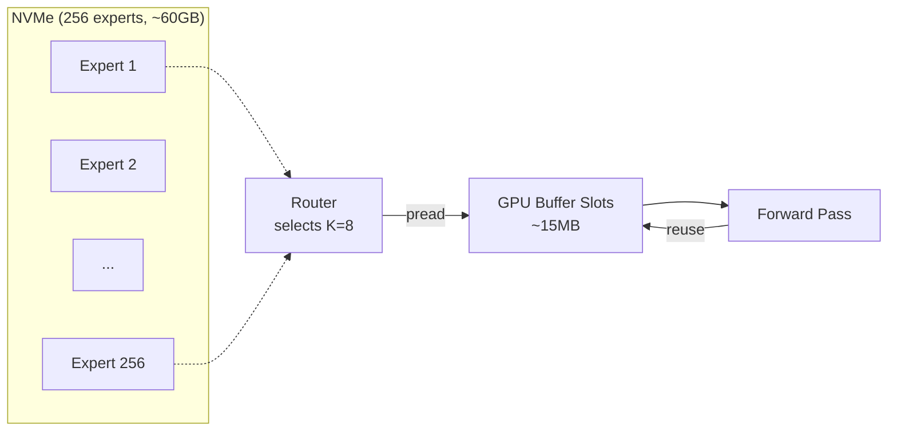

The same idea generalizes to dense models.  A 70B at Q4 is ~35GB — a 24GB
card can run it by streaming layers from disk.  Higher latency (NVMe-bound),
but the model runs.

---

## Prompt Caching

> See [Prompt Caching](prompt-caching.md) for the implementation: hash-based
> lookup, reference counting, block-aligned sharing, and eviction.

Most API traffic shares a common prefix.  System prompts, tool definitions,
and few-shot examples repeat identically across requests.  Prompt caching
computes the KV once and shares the physical blocks.

### Mechanism

rLLM's paged KV cache uses block-table indirection.  The `PrefixCache` maps
token-sequence hashes to physical block indices:

```
Request 1 (cold):
  prefill 1024 tokens → writes blocks [0..63]
  register in PrefixCache: hash(tokens[0..1024]) → [0..63]

Request 2 (same system prompt, different user message):
  lookup hash → hit → copy block refs into new block table
  prefill only the 50 suffix tokens → writes blocks [64..67]
```

The attention kernel sees a contiguous sequence.  Block-table indirection
makes sharing transparent.

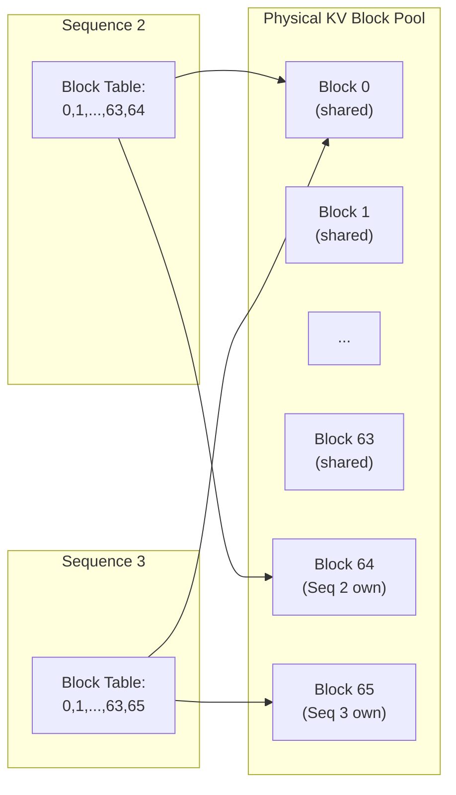

Reference counting keeps shared blocks alive.  Eviction is LRU among entries
with zero active references.

### Cache routing

The prefix cache is **local to each engine instance**.  A request only hits
cache if it lands on the server that computed it.  Routing strategy is the
biggest lever for hit rate.

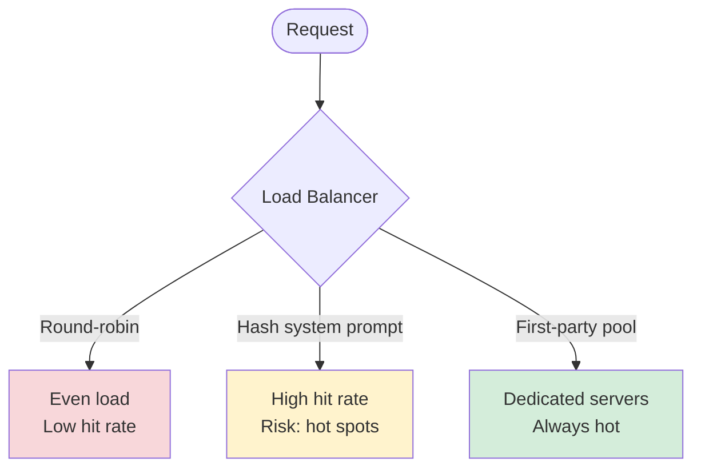

- **Round-robin** — even load, N× duplicate cache entries, N× cold prefills
- **Hash on system prompt** — high hit rate; consistent hashing mitigates hot spots
- **Dedicated first-party pools** — your clients share one prompt, always hot

First-party traffic is easy: one system prompt, 100% hit rate.  API customers
converge organically — each has a few stable prompts.  Route by API key or
prompt hash.

---

## Economics

LLM inference economics come down to one question: how many tokens can you
extract per GPU-hour, and what do you charge per token?  Four levers —
batching, weight quantization, KV cache quantization, and prompt caching —
determine cost per token.  Hardware selection and tier differentiation
determine what you charge.  Everything connects: cheaper cost per token lets
you offer lower prices or higher margins, and the pricing structure itself
shapes user behaviour in ways that improve GPU utilisation.

### Cost levers

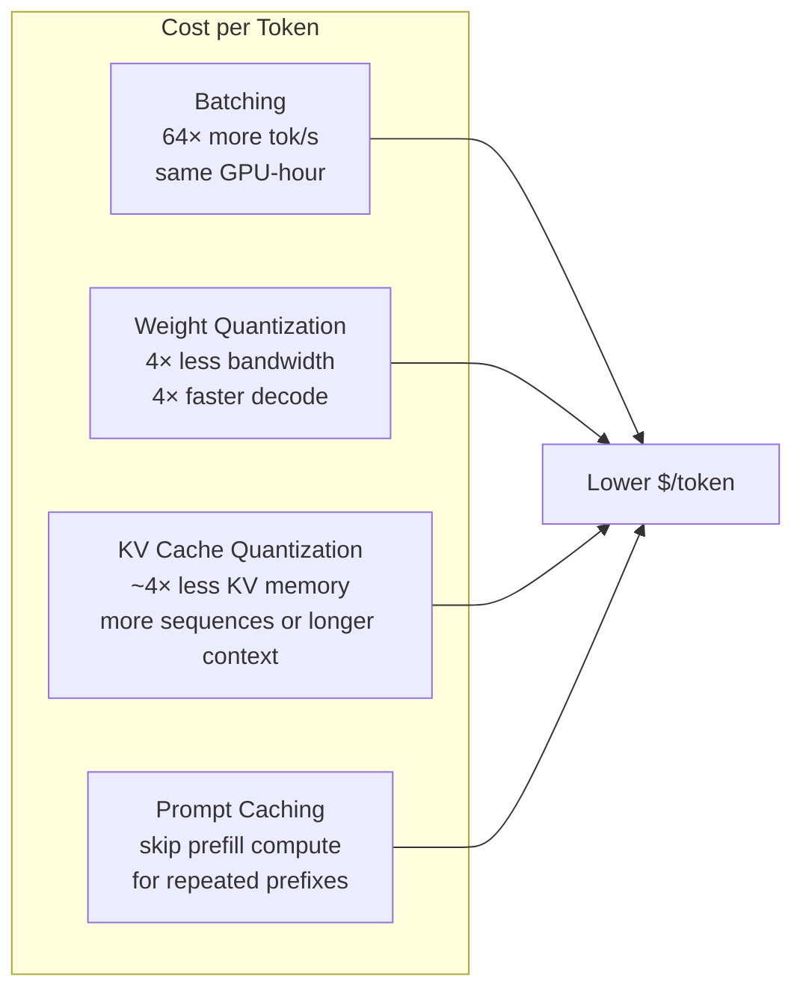

**Batching is the business model.**  An H100 at ~$2–3/hr decoding one
sequence produces ~25 tok/s.  Batch 64 sequences from the same GPU-hour:
~1600 tok/s.  64× lower cost per token.  Without batching, LLM inference
APIs don't work economically.

**Weight quantization is pure margin.**  Q4 vs bf16 gives ~4× more tokens
per GPU-hour at near-identical quality.  Charge the same price: 4× margin.
Pass savings to users: undercut competitors.  Either way, it's a direct
multiplier on unit economics.

**[KV cache quantization](turboquant.md) is concurrency multiplication.**
KV cache is the memory that scales with concurrent users × context length.
TurboQuant 4-bit compresses it ~4× with no quality loss — same GPU can hold
~4× more active sequences, or serve ~4× longer contexts, or any mix of
both.  On a 64 GB M4 Max serving Qwen 3.5 9B, that's ~2,000 concurrent
sequences vs ~400 at BF16.  For long-context workloads the effect compounds:
a 32K-token sequence drops from ~5.3 GB to ~1.1 GB.

**Prompt caching is throughput multiplication.**  Prefill (processing the
prompt) is compute-bound and often the dominant per-request cost.  A
4000-token system prompt takes ~800ms to prefill on a 70B model.  Cache that
prefix and subsequent requests skip it entirely — TTFT drops from ~800ms to
the user-message suffix (10–50ms).

| Metric | No cache | 90% hit rate |
|--------|----------|-------------|
| Prefill per request | 1000 tokens | 100 tokens (suffix only) |
| TTFT | ~200 ms | ~20 ms |
| Prefill compute | ~200 TFLOP | ~20 TFLOP |
| Max prefills/sec | ~5 | ~50 |

A workload that's 60% prefill-bound can nearly double effective throughput
with a hot cache — same hardware, same price, 2× the requests served.

### Pricing

Pricing can incentivise user behaviour that improves your GPU utilisation.

**Cached token discounts.**  Anthropic charges cached input tokens at 90%
discount.  The provider's marginal cost for a cached token is near zero — the
KV already exists in GPU memory.  The discount nudges users to structure
prompts for cacheability (stable prefix first, variable content last), which
improves hit rates and GPU utilisation for the provider.  A virtuous cycle.

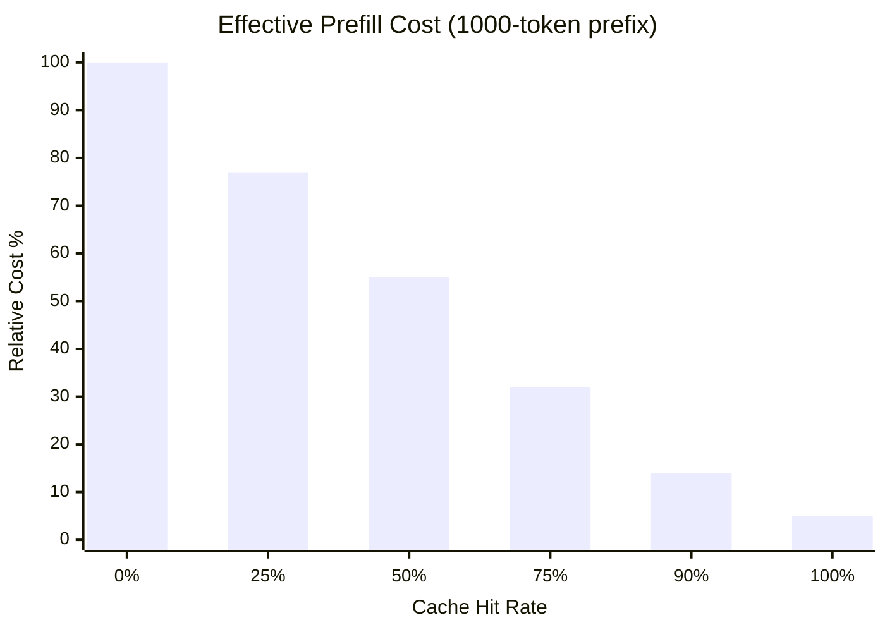

**Model size premium.**  A 7B fits on a consumer GPU; a 70B needs 4×H100s.
10–50× cost difference.  The large-model premium pays for the fleet.

**Why caching economics work.**  System prompts are simultaneously the
longest, most repetitive, and most expensive part of the input.  Caching the
thing that costs the most gives the biggest return.  At 100 req/s with a
4000-token prefix at 90% hit rate, that's 72 GPU-seconds of prefill compute
saved per wall-clock second.

### Tiers

Same model, same API, different hardware behind it.  Tiers are a mix of
hardware generation, quantization level, VRAM residency, and queue priority.

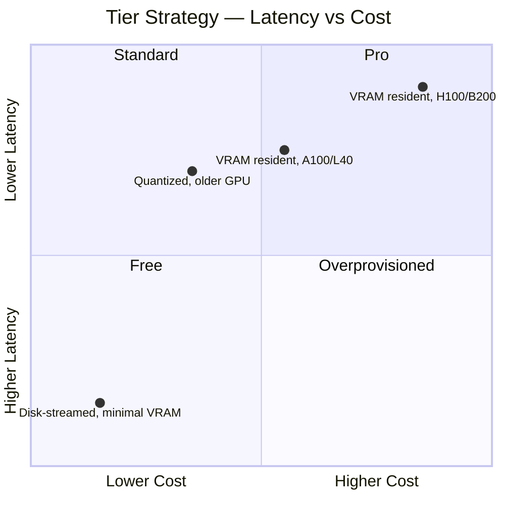

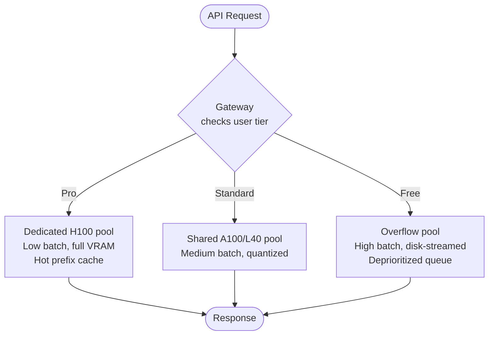

Pro users get dedicated GPU pools with low batch sizes and aggressive latency
SLOs.  Free users get overflow pools on older hardware, higher batch sizes,
disk-streamed models, and lower queue priority.  The GPU does the same work —
the difference is queue position and how much of the model lives in VRAM.

### Capacity planning

Default: 64 cached prefixes per instance.  First-party pool needs one slot.
API pattern: 64 covers your top customers by traffic (power-law
distribution).  A 1000-token prefix costs ~128MB; 64 entries = ~8GB —
significant on 24GB, negligible on 80GB.

### QA and eval

The gate between a model drop and a tier deployment: which models, at which
precisions, on which hardware, pass the quality bar?

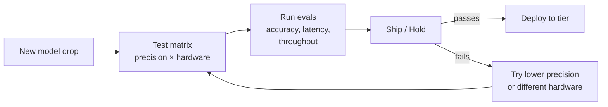

The goal is CI/CD for models: spin up servers for each config, run evals,
produce reports.  "Llama 70B Q4 on 2×A100: passes quality bars, 35ms/tok
p50, $X/M tokens — ship it."

---

## Security Controls

> See [Threat Model](threat-model.md) for the full STRIDE analysis.

The inference fleet holds model weights and produces raw completions — two
assets worth protecting.  The security model treats it as a high-value,
low-surface-area zone.

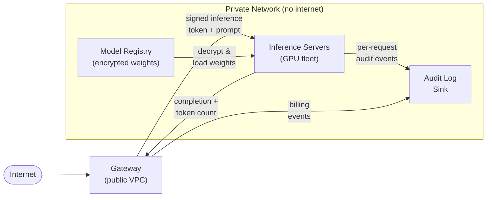

### Authentication and token exchange

The gateway validates the customer's API key, mints a short-lived,
customer-scoped inference token, and attaches it to the request.  The
inference server verifies the token before running a forward pass.

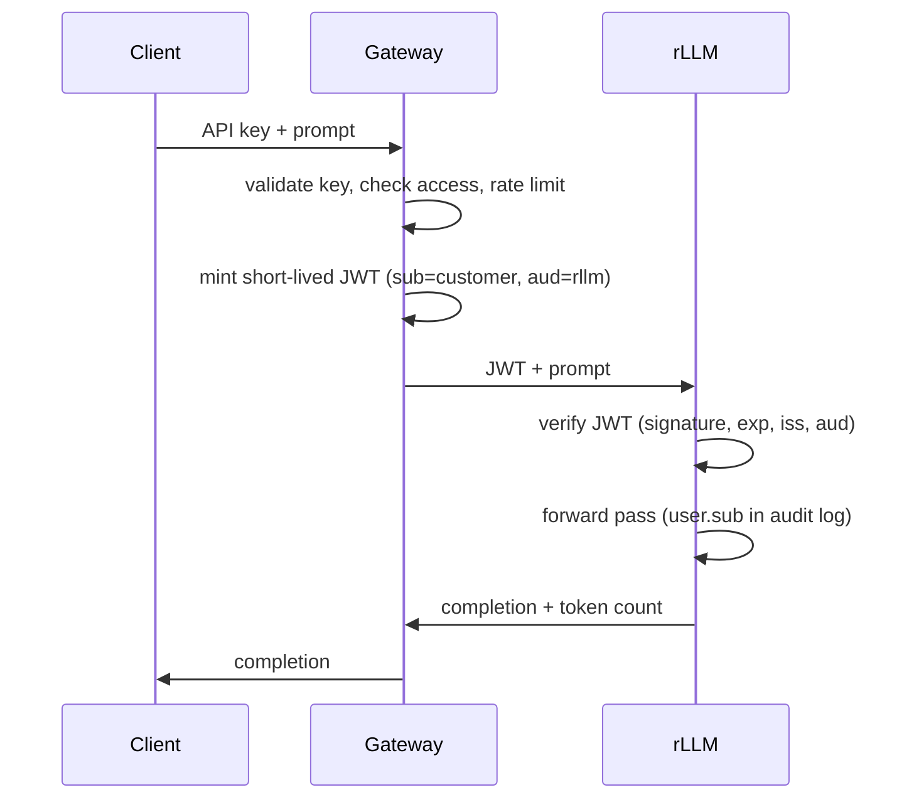

Three properties:

1. **Identity at the inference layer** — every forward pass is tied to a
   customer, not just a gateway session
2. **Token theft detection** — inference activity without a matching gateway
   session is anomalous
3. **Blast radius** — a leaked inference token expires quickly and only
   authorises inference, not billing or account mutations

**rLLM implements this** via its pluggable auth hook system (`--auth-config`).
The built-in OIDC provider validates JWTs against the issuer's published
JWKS.  The `AuthProvider` trait can be extended to support an org's specific
auth — custom token formats, internal CAs, proprietary identity systems.
See [Authentication](authentication.md) for the full design.

### Audit logging

Every inference request is logged with customer identity, model, token
counts, latency, and timestamp.  The audit log is ground truth for:

- **Billing reconciliation** — compare inference-side and gateway-side token
  counts; discrepancies flag bugs or fraud
- **Abuse detection** — unusual volume, odd hours, pattern anomalies
- **Forensics** — trace harmful output to the exact request and customer

When auth is enabled, rLLM logs the authenticated user identity (JWT `sub`
claim) alongside token counts and latency in its per-request stderr output —
inference-side audit logging without additional infrastructure.

Both streams (inference-side and gateway-side) ship to a **log gateway**
within the private VPC, which forwards off-VPC to a central store.  Inference
servers never talk to the central store directly.

### Network isolation


Inference servers have **no standing outbound access**.  The only persistent
flow is inference to/from the gateway.

**JIT registry access.**  To pull weights, a short-lived route to the model
registry is provisioned, weights are cloned to local NVMe, and the route is
torn down.  Provisioning requires two-person approval with hardware-backed
(YubiKey) authentication.

### Weight protection

Weights are protected at the infrastructure layer — the inference server
never sees ciphertext.

- **Registry-level encryption** — weights encrypted at rest, decryption keys
  bound to inference server service accounts
- **Full-disk encryption** — NVMe encrypted via LUKS/FileVault/cloud KMS;
  rLLM calls `mmap`/`pread` and gets decrypted bytes transparently
- **No standing SSH** — shell access is break-glass: PR, peer approval,
  time-limited, auto-revoked

### Traffic volume monitoring

Outbound volume is monitored against audit-log token counts.  Unexpected
volume — more bytes than token counts warrant — triggers alerts.  This
catches weight exfiltration (a 70B Q4 is ~35GB), bulk inference abuse, or
a compromised server streaming data via an allowed egress path.

---

## Server-Side Tools

> See [Tool Calling](tool-calling.md) for rLLM's per-architecture prompt
> formatting, output parsing, and API surface.

The inference server produces tool-call JSON.  It never executes tools.


The gateway hands off tool-call requests to a **tool worker** — a stateful
process that owns the multi-round-trip loop.  The worker talks to the
inference server, dispatches tool calls to an isolated tool cluster, feeds
results back, and repeats until the model produces a final completion.

### Why isolate tool execution

- **Different compute profile** — tools are CPU-bound; running them on GPU
  machines wastes $2–3/hr hardware on $0.10/hr work
- **Different security profile** — tools may need network/filesystem/DB
  access; inference servers have none of these
- **Independent scaling** — tool traffic is bursty; tool cluster scales on
  CPU via Kubernetes, inference cluster scales on GPU availability
- **Blast radius** — a hanging tool affects one step of one request, not
  the GPU batch

### Worker orchestration

The tool worker manages the agent loop:

```
gateway → worker → inference → tool_call → tool cluster → tool_result →
inference → tool_call → tool cluster → tool_result →
inference → final completion → worker → gateway → client
```

Policy is split: the **gateway** enforces tool allow-lists and rate limits
before handoff.  The **worker** enforces per-request limits during the loop:
max tool calls, per-tool timeouts, and loop deadlines.  The inference server
just produces JSON.

---

## What This Means for rLLM

rLLM is the inference server in the diagram: model loading, Q4 quantization,
continuous batching, GPU dispatch, streaming generation, and an
OpenAI/Anthropic-compatible API.

Billing, routing, rate limiting, and tiering belong in the gateway.
Authentication is shared: the gateway authenticates the end user and mints a
scoped token; rLLM verifies it via its pluggable auth hook system
(`--auth-config`).  The built-in OIDC provider handles standard JWT
validation; the `AuthProvider` trait can be extended to support an org's
specific auth infrastructure without modifying rLLM's core.  When auth is
enabled, per-user identity is logged to stderr alongside token counts and
latency — audit logging at the inference layer for free.

---

## Related Documents

- [Authentication](authentication.md) — auth hook system, OIDC provider, custom providers
- [Inference Engine](inference-engine.md) — step loop, scheduler, continuous batching
- [KV Cache](kv-cache.md) — paged allocation, block tables, generational indices
- [Prompt Caching](prompt-caching.md) — prefix sharing, ref counting, eviction
- [Quantization](quantization.md) — Q4 format, pre-quantization, kernel dequantization
- [TurboQuant](turboquant.md) — KV cache vector quantization, ~4× compression, quality-neutral
- [Expert Streaming](expert-streaming.md) — SSD-backed MoE, LRU cache, pread I/O
- [API Server](api-server.md) — HTTP endpoints, worker thread, streaming
- [Tool Calling](tool-calling.md) — per-architecture formats, parsing, API surface
- [Threat Model](threat-model.md) — STRIDE analysis, weight theft, customer data, residual risks
