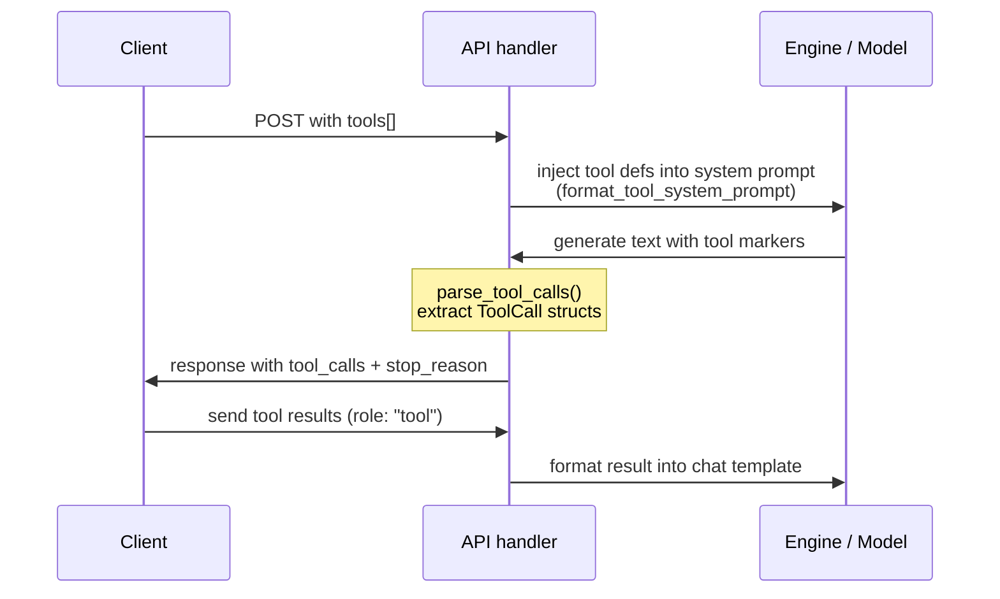

# Tool Calling

Tool/function calling lets models invoke external functions during a conversation.
rLLM supports tool calling through both the OpenAI and Anthropic API endpoints,
with per-architecture prompt formatting and output parsing.

---

## End-to-End Flow



1. Client sends a request with `tools` (array of function definitions)
2. API handler calls `format_tool_system_prompt()` to inject definitions into the
   system message using the model's native format
3. Model generates text containing tool call markers
4. `parse_tool_calls()` extracts structured `ToolCall` objects from the output
5. Response includes tool calls and `finish_reason: "tool_calls"` (OpenAI) or
   `stop_reason: "tool_use"` (Anthropic)
6. Client executes the tools, sends results back as `role: "tool"` messages
7. Results are formatted by the chat template (`chat.rs`) and the model continues

---

## API Usage

### OpenAI Endpoint (`/v1/chat/completions`)

```json
{
  "model": "qwen-2.5-7b",
  "messages": [{"role": "user", "content": "What's the weather in NYC?"}],
  "tools": [{
    "type": "function",
    "function": {
      "name": "get_weather",
      "description": "Get weather for a location",
      "parameters": {
        "type": "object",
        "properties": {
          "city": { "type": "string" }
        },
        "required": ["city"]
      }
    }
  }],
  "tool_choice": "auto"
}
```

Response when the model calls a tool:

```json
{
  "choices": [{
    "message": {
      "role": "assistant",
      "content": null,
      "tool_calls": [{
        "id": "call_a1b2c3d4e5f6g7h8",
        "type": "function",
        "function": {
          "name": "get_weather",
          "arguments": "{\"city\": \"NYC\"}"
        }
      }]
    },
    "finish_reason": "tool_calls"
  }]
}
```

Send the result back:

```json
{
  "messages": [
    {"role": "user", "content": "What's the weather in NYC?"},
    {"role": "assistant", "tool_calls": [{"id": "call_a1b2c3d4e5f6g7h8", "type": "function", "function": {"name": "get_weather", "arguments": "{\"city\": \"NYC\"}"}}]},
    {"role": "tool", "tool_call_id": "call_a1b2c3d4e5f6g7h8", "content": "{\"temp\": 72, \"condition\": \"sunny\"}"}
  ]
}
```

`tool_choice` options:
- `"auto"` (default) — model decides whether to call tools
- `"none"` — tools are stripped from the prompt, model responds normally

### Anthropic Endpoint (`/v1/messages`)

```json
{
  "model": "qwen-2.5-7b",
  "max_tokens": 1024,
  "messages": [{"role": "user", "content": "What's the weather in NYC?"}],
  "tools": [{
    "name": "get_weather",
    "description": "Get weather for a location",
    "input_schema": {
      "type": "object",
      "properties": {
        "city": { "type": "string" }
      },
      "required": ["city"]
    }
  }]
}
```

Response uses `tool_use` content blocks:

```json
{
  "content": [
    {"type": "text", "text": "Let me check the weather."},
    {"type": "tool_use", "id": "call_a1b2c3d4e5f6g7h8", "name": "get_weather", "input": {"city": "NYC"}}
  ],
  "stop_reason": "tool_use"
}
```

Note: Anthropic tool definitions use `input_schema` instead of `parameters` and
`name` at the top level instead of nested under `function`.  The API handler
converts to the internal format automatically.

### Streaming with Tools

When `stream: true` and tools are provided, both endpoints **collect the full
response first** then emit it, since tool calls must be parsed from the complete
output.  Streaming without tools works normally (token-by-token SSE).

---

## Per-Architecture Formats

Each model family was fine-tuned on its own tool calling format.  Using the wrong
format produces unreliable results.

| Architecture | Prompt Format | Output Format | Parser |
|-------------|---------------|---------------|--------|
| Llama 3.x | JSON list in system prompt | Bare JSON `{"name": ..., "arguments": ...}` | `parse_tool_calls_generic` (bare JSON fallback) |
| Qwen, Phi, Gemma, GPT-OSS | `# Tools` section with `<tool_call>` instructions | `<tool_call>...</tool_call>` XML markers | `parse_tool_calls_generic` (XML markers) |
| Mistral, Mixtral | `[AVAILABLE_TOOLS]...[/AVAILABLE_TOOLS]` | `[TOOL_CALLS][{...}]` | `parse_tool_calls_mistral` |

### API Response Formats

After parsing, tool calls are returned to the client in the endpoint's native format:

| Endpoint | Tool Call Field | Stop Reason | Tool Result Role |
|----------|----------------|-------------|------------------|
| OpenAI `/v1/chat/completions` | `message.tool_calls[]` (id, type, function.name, function.arguments) | `"tool_calls"` | `role: "tool"` with `tool_call_id` |
| Anthropic `/v1/messages` | `content[]` block with `type: "tool_use"` (id, name, input) | `"tool_use"` | `type: "tool_result"` content block |

### Internal Result Formatting

Tool results sent back by the client are formatted per-architecture in the chat
template (`chat.rs`), using helpers from `tools.rs`:

| Architecture | Format |
|-------------|--------|
| Llama | `<\|start_header_id\|>ipython<\|end_header_id\|>` role |
| Qwen/ChatML | `<\|im_start\|>tool` with `<tool_response>` markers |
| Gemma | `<start_of_turn>tool` role |
| Phi | `<\|im_start\|>tool<\|im_sep\|>` |
| Mistral | `[TOOL_RESULTS]...[/TOOL_RESULTS]` markers |

---

## Parsing Strategy

`parse_tool_calls()` (in `tools.rs`) dispatches by architecture:

- **Mistral/Mixtral**: looks for `[TOOL_CALLS]` marker, parses the following JSON array
- **All others**: tries three strategies in order:
  1. `<tool_call>...</tool_call>` XML markers (Qwen-style)
  2. Bare JSON objects with a `"name"` field (Llama-style, one per line)
  3. No tool calls found — return the original text unchanged

This layered approach handles models that sometimes mix formats or omit markers.

---

## Key Types (`src/model/tools.rs`)

| Type | Purpose |
|------|---------|
| `ToolDefinition` | A tool the model can call (name, description, JSON Schema params) |
| `FunctionDefinition` | The function's name, description, and parameter schema |
| `ToolCall` | Extracted from model output: id + function name + arguments JSON string |
| `FunctionCall` | The function name and serialized arguments |

---

## Related Files

- `src/model/tools.rs` — types, prompt formatting, output parsing
- `src/model/chat.rs` — chat templates, tool result formatting per architecture
- `src/api/openai.rs` — OpenAI tool calling API (`tools`, `tool_choice`, `tool_calls`)
- `src/api/anthropic.rs` — Anthropic tool use API (`tools`, `tool_use` blocks)
