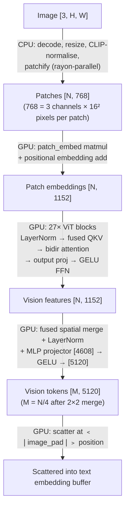

# Vision Encoder

rLLM supports vision-language models (VLMs) like Qwen 3.5 VL and Gemma 3 that
can process images alongside text.  The vision encoder converts images into
embedding vectors that slot into the LLM's token sequence, letting the model
"see" images.

**Key files:**
- `src/model/vision.rs` — ViT forward pass, image preprocessing
- `src/model/config.rs` — `VisionConfig` (parsed from config.json)
- `src/model/loader.rs` — vision weight loading (f32 to bf16 conversion, QKV fusion)
- `src/model/chat.rs` — chat templates with vision placeholders
- `src/model/mod.rs` — integration point in `forward_prefill_paged()`
- `src/gpu/ops/vision.rs` — `GpuVision` trait (spatial merge, scatter)
- `src/gpu/ops/attention.rs` — `prefill_attention_fused_qkv()`
- `src/gpu/metal/shaders/vision.metal` — spatial merge + scatter kernels
- `src/gpu/metal/shaders/attention.metal` — fused QKV bidirectional attention kernel

---

## Architecture

Both Qwen 3.5 VL and Gemma 3 use a SigLIP-based Vision Transformer (ViT) with
27 blocks, 1152 hidden dim, and 16 attention heads (~0.6B parameters).

### Pipeline



### ViT Block Detail

Each of the 27 transformer blocks runs:

1. **LayerNorm** (not RMSNorm) — must match SigLIP's training normalisation
2. **Fused QKV matmul** — one `[3*hd, hd]` weight produces `[N, 3*hd]` output
3. **Fused bidirectional attention** — `prefill_attention_fused_qkv` reads Q/K/V
   at stride offsets within the interleaved buffer.  `causal=false` — every
   patch attends to every other patch (images have no left-to-right ordering)
4. **Output projection + residual**
5. **LayerNorm -> Plain GELU FFN** (fc1 expands 1152->4304, fc2 contracts back)
6. **Residual**

All projections include bias terms (SigLIP design, unlike LLM layers).

---

## Optimisations

### Fused QKV Matmul

Instead of 3 separate matmuls per ViT block (81 kernel launches total), a single
matmul with a `[3*hd, hd]` weight produces the entire QKV output `[N, 3*hd]`.
The fused attention kernel reads Q, K, V at stride offsets within each row:
- Q: offset 0
- K: offset `num_heads * head_dim`
- V: offset `2 * num_heads * head_dim`

This eliminates 54 kernel dispatches and 3x input bandwidth for Q/K/V projection.

### Fused Spatial Merge + LayerNorm

The standard pipeline writes `[N/4, 4608]` to global memory (spatial merge),
reads it back (LayerNorm), then reads again (MLP fc1).  The `spatial_merge_norm`
kernel fuses the first two steps: each threadgroup gathers 2x2 patches, computes
LayerNorm in shared memory, and writes the normalised result once.

### Rayon-Parallel Preprocessing

Image preprocessing (normalise + patchify) is parallelised across patch rows
using `rayon::par_chunks_mut`.  Each patch row spans `patch_size` image rows and
writes to a non-overlapping slice of the output buffer, so there are no data
races.

---

## Data Flow

### API Server Path

```
1. HTTP request with base64 image (OpenAI multimodal content format)
2. chat.rs: build message with ImageData, insert <|image_pad|> placeholder
3. tokenizer: encode chat template -> prompt_tokens (1 pad token per image)
4. api/mod.rs: preprocess_images() on handler thread (CPU, rayon-parallel)
5. engine: add_request(prompt_tokens, images)
6. prefill: embed_lookup -> vision_encode -> scatter -> transformer
```

### CLI Path

```
1. --image flag reads file from disk
2. preprocess_image() on main thread (CPU, rayon-parallel)
3. chat template -> tokenize
4. engine: add_request(prompt_tokens, images)
5. prefill: embed_lookup -> vision_encode -> scatter -> transformer
```

---

## Qwen 3.5 vs Gemma 3

| Aspect | Qwen 3.5 VL | Gemma 3 |
|---|---|---|
| Patch size | 16x16 | 14x14 |
| QKV weights in checkpoint | Fused `[3*hd, hd]` | Separate Q/K/V (concatenated during loading) |
| Spatial merge | 2x2 (4x token reduction) | None (fixed 256 tokens) |
| Projector | 2-layer MLP with LayerNorm | Single linear layer |
| Temporal patch | Size 2 (for video, averaged at load) | None |
| Weight prefix | `model.visual.*` | `vision_tower.*` |
| Post-norm | No | Yes (after all ViT blocks) |

Both use the same forward pass code — differences are handled by `VisionConfig`
flags and `Option` fields on the weight structs.

---

## Usage

### CLI

```bash
cargo run --release -- run \
  --model models/qwen3.5-vl-3b-instruct \
  --prompt "Describe this image" \
  --chat --image photo.jpg \
  --max-tokens 256
```

### API (OpenAI format)

```bash
curl http://localhost:8080/v1/chat/completions \
  -H "Content-Type: application/json" \
  -d '{
    "messages": [{"role": "user", "content": [
      {"type": "image_url", "image_url": {"url": "data:image/jpeg;base64,'"$(base64 < photo.jpg)"'"}},
      {"type": "text", "text": "What do you see?"}
    ]}],
    "max_tokens": 256
  }'
```

### API (Anthropic format)

```bash
curl http://localhost:8080/v1/messages \
  -H "Content-Type: application/json" \
  -d '{
    "messages": [{"role": "user", "content": [
      {"type": "image", "source": {"type": "base64", "media_type": "image/jpeg", "data": "'"$(base64 < photo.jpg)"'"}},
      {"type": "text", "text": "What do you see?"}
    ]}],
    "max_tokens": 256
  }'
```

---

## Adding Vision to a New Architecture

1. Parse `vision_config` in `config.rs` — set `VisionConfig` fields
2. Set `image_token_id` from the model's config.json
3. Load vision weights in `loader.rs` — implement `load_<arch>_vision_block()`
4. Add a chat template arm in `chat.rs` with `<|image_pad|>` placeholders
5. The forward pass in `mod.rs` handles vision encoding + scatter generically

The ViT architecture (27 blocks, 1152 hidden, 16 heads) is shared — only the
weight loading, config parsing, and merger structure differ between models.
